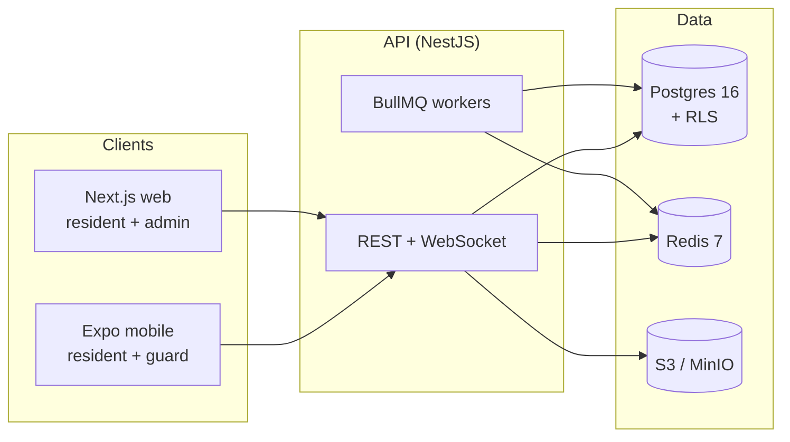

# Architecture overview

SmartResidence is a TypeScript monorepo with three deployable apps and a
handful of shared libraries.

## Apps

- **`apps/api`** — NestJS REST + WebSocket API. Prisma + Postgres, with
  Postgres Row-Level Security for tenant isolation.
- **`apps/web`** — Next.js 15 App Router. Houses both the resident portal and
  the management `/admin` dashboard.
- **`apps/mobile`** — Expo SDK 52 app. Resident and guard mode share the same
  binary, gated by role at boot.

## Shared packages

- **`@smartresidence/shared-types`** — Zod schemas + inferred TS types.
- **`@smartresidence/api-client`** — Typed REST client and TanStack Query hooks
  generated from the OpenAPI spec.
- **`@smartresidence/ui-web`** — shadcn/Radix components, Tailwind preset,
  Framer Motion presets.
- **`@smartresidence/ui-mobile`** — NativeWind + Moti components.

## Why this stack

- **One language end-to-end** keeps the contributor pool wide.
- **Postgres RLS** enforces multi-tenancy in the database, not just the app
  layer — a hardening default that's hard to bypass.
- **OpenAPI-first** keeps mobile, web, and any community-built integrations
  type-safe automatically.
- **Better Auth + CASL** gives us passkeys, 2FA, OTP and a single rules engine
  used by API guards, web pages, and mobile screens.
