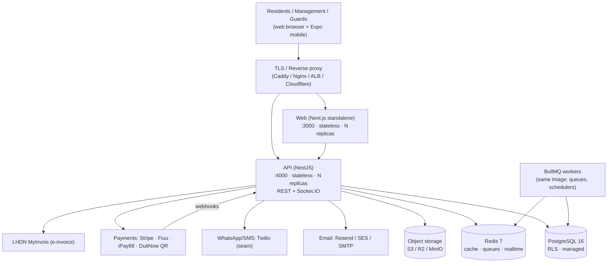
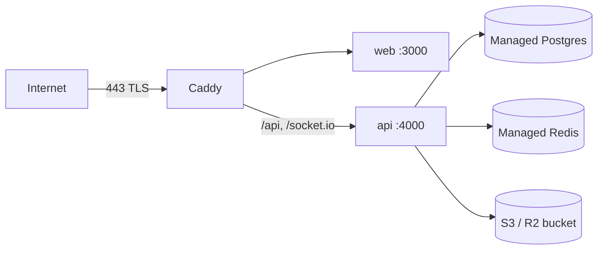

# Cloud deployment guide

> **Audience:** whoever operates a **managed / hosted** SmartResidence (the
> paid offering in [`docs/BUSINESS_MODEL.md`](./BUSINESS_MODEL.md)), or a JMB
> running a serious production instance rather than a laptop trial.
>
> For laptop/VPS trials and the developer stack, start with
> [`docs/SELF_HOSTING.md`](./SELF_HOSTING.md).

This document describes a **reference architecture** and pragmatic deploy
targets. It clearly separates what the repo supports **today** from what
**requires work** before you rely on it.

---

## 1. Reference architecture

SmartResidence is a standard 3-tier app: stateless Node services in front of
Postgres + Redis + object storage, with outbound email/WhatsApp and inbound
payment webhooks.

**Key properties grounded in the code:**

- **API and web are stateless** — scale horizontally; all state is in Postgres,
  Redis, and object storage.
- **Realtime is Socket.IO** (`realtime.gateway`). With multiple API replicas you
  need a **Redis adapter / sticky sessions** so socket rooms work across
  instances (see [§6 Scaling](#6-scaling)).
- **Multi-tenancy is enforced in depth**: Postgres **Row-Level Security**
  (`prisma/migrations/rls.sql`) *plus* application-layer **CASL** abilities.
- **Per-condo secrets** (payment gateway credentials) are **AES-256-GCM
  envelope-encrypted** at rest under `BILLING_ENCRYPTION_KEY` and never returned
  to clients.
- **Health:** `GET /health` returns `{ status, checks: { database, redis } }`
  for liveness/readiness probes.

---

## 2. Single-tenant vs multi-tenant

SmartResidence is **multi-tenant by design** — every domain row is scoped by
`condoId`, protected by RLS + CASL, and a `SUPER_ADMIN` role with `manage all`
exists for platform operators.

| Model | What it means here | When to choose it |
| ----- | ------------------ | ----------------- |
| **Multi-tenant (shared)** | One deployment hosts many condos; isolation via `condoId` + RLS + CASL. `SUPER_ADMIN` can provision/oversee. | The default for the **managed cloud** offering — best density and lowest per-condo cost. |
| **Single-tenant (dedicated)** | One deployment per condo/JMB (own DB, own domain). | A JMB self-hosting; enterprise clients with data-residency or procurement requirements; anyone wanting hard isolation. |

> **Reality check on the platform console:** the `SUPER_ADMIN` role and
> `manage all` ability are **built**, and a `/admin/platform` surface exists, but
> a *full* cross-condo operations console (provisioning, plan/usage metering,
> feature flags, audited support impersonation) is **partially built / roadmap**
> (see ROADMAP §4.14). For early managed customers, run **single-tenant** or a
> small shared cluster and provision condos via the setup wizard + seed until the
> platform console matures.

---

## 3. Deploy targets (pick pragmatically)

Ordered from simplest to most involved. **Recommendation: start with Option A.**

### Option A — Single VM with Docker Compose *(recommended first step)*

Best for: first paying customers, single-tenant enterprise, cost-sensitive JMBs.

- Provision one VM (2 vCPU / 4 GB is comfortable for a few hundred units).
- Deploy the **`deploy/` compose** (or a hardened fork of it) — API + web + a
  reverse proxy; point Postgres/Redis/storage at **managed** services (below)
  rather than in-container for anything you care about.
- Put **Caddy** (automatic Let's Encrypt TLS) or Nginx in front on `:443`.

Serving web and API **behind one origin** (e.g. `app.yourdomain.com` → web,
`app.yourdomain.com/api` → API) avoids the `NEXT_PUBLIC_API_URL` build-time
inlining problem and simplifies CORS/cookies.

### Option B — Container platform / PaaS

Best for: teams who want managed rollout without owning Kubernetes.

- Run the **api** and **web** images on a PaaS (Fly.io, Render, Railway, Google
  Cloud Run, AWS App Runner, Azure Container Apps).
- Use the platform's **managed Postgres + Redis** add-ons and an **S3/R2**
  bucket.
- Run `prisma migrate deploy` as a **release/pre-deploy** step (the `migrate`
  one-shot in the draft compose is the template).
- For Socket.IO across multiple web/api instances, enable **session affinity**
  or the Redis adapter.

### Option C — Kubernetes *(requires work — no chart in repo yet)*

Best for: multi-tenant scale, existing k8s operators.

> ⚠️ **Honest status:** `infra/k8s/` and a Helm chart are referenced in older
> docs but are **not present** in the repository today. The sketch below is what
> to build, not something you can `helm install` now.

Sketch of the workloads:

| Workload | Kind | Notes |
| -------- | ---- | ----- |
| `api` | Deployment (≥2 replicas) + Service | `/health` for liveness+readiness; env from Secret/ConfigMap. |
| `web` | Deployment (≥1) + Service | Build-time `NEXT_PUBLIC_API_URL` → serve behind same Ingress host. |
| `worker` | Deployment | Same image as `api`; runs BullMQ consumers/schedulers (split out for independent scaling). |
| `migrate` | Job (Helm `pre-install`/`pre-upgrade` hook) | `prisma migrate deploy`. |
| Ingress | Ingress + cert-manager | TLS, host routing, sticky sessions for Socket.IO. |
| Postgres / Redis | External managed services | Don't run stateful DBs in-cluster unless you have an operator you trust. |

---

## 4. Managed dependencies checklist

| Concern | Recommended (cloud) | MY-friendly options | Repo support today |
| ------- | ------------------- | ------------------- | ------------------ |
| **Database** | Managed Postgres 16 (RDS, Cloud SQL, Neon, Supabase) | Any region incl. Singapore for latency | ✅ Prisma + RLS |
| **Cache/queues/realtime** | Managed Redis 7 (ElastiCache, Upstash, Memorystore) | — | ✅ ioredis + BullMQ |
| **Object storage** | AWS S3, Cloudflare R2, Backblaze B2 | R2 (no egress fees) | ✅ S3-compatible, path-style toggle |
| **Email** | Resend or SES | — | ✅ `RESEND_API_KEY` / SMTP |
| **WhatsApp / SMS** | Twilio (built seam) | Meta Cloud API / local MY gateway *(would need an adapter)* | ✅ Twilio seam; per-condo config |
| **Payments (global)** | Stripe | — | ✅ live |
| **Payments (MY)** | Fiuu (Razer), iPay88, **DuitNow QR** | TNG / Boost / GrabPay via aggregators today | ✅ DuitNow QR adapter; ⬜ dedicated e-wallet adapters |
| **E-invoice** | LHDN **MyInvois** | Sandbox → production | ✅ production provider seam + sandbox |
| **TLS / domains** | Caddy / cert-manager / Cloudflare | — | ➖ provided by your proxy |

---

## 5. Environment & secrets management

The API validates its environment on boot via a Zod schema
(`apps/api/src/config/env.schema.ts`) and **refuses to start** on invalid config.

### Required

| Var | Constraint | Notes |
| --- | ---------- | ----- |
| `DATABASE_URL` | valid URL | Managed Postgres connection string. |
| `REDIS_URL` | valid URL | Add credentials/TLS (`rediss://`) for managed Redis. |
| `BETTER_AUTH_SECRET` | **≥ 32 chars** | Random. Rotating invalidates sessions. |
| `BETTER_AUTH_URL` | valid URL | Public API base URL. |
| `S3_ENDPOINT` | valid URL | S3/R2/MinIO endpoint. |
| `S3_ACCESS_KEY` / `S3_SECRET_KEY` | non-empty | Storage credentials. |

### Strongly recommended in production

| Var | Why |
| --- | --- |
| `BILLING_ENCRYPTION_KEY` | 32-byte key that envelope-encrypts per-condo payment credentials. In dev a deterministic key is derived; **production must set a strong random value** or gateway secrets are weakly protected. |
| `SESSION_COOKIE_DOMAIN` | Your real domain so session cookies scope correctly. |
| `CORS_ORIGINS` | Comma-separated list of allowed web origins (defaults to localhost). |
| `NODE_ENV=production` | Disables Swagger, enables HSTS in Helmet. |

### Optional integrations (unset = feature dormant)

`RESEND_API_KEY`, `SMTP_*`, `TWILIO_ACCOUNT_SID` / `TWILIO_AUTH_TOKEN` /
`TWILIO_FROM`, `STRIPE_SECRET_KEY` / `STRIPE_WEBHOOK_SECRET`. Per-condo payment
gateway and MyInvois credentials are configured **in the admin UI** (encrypted at
rest), not via global env.

### Secret-management checklist

- [ ] Generate **unique** `BETTER_AUTH_SECRET` and `BILLING_ENCRYPTION_KEY`
      (`openssl rand -base64 48`) per environment — never reuse dev samples.
- [ ] Store secrets in a manager (AWS Secrets Manager, GCP Secret Manager, Vault,
      Doppler, or your PaaS secret store) — **not** in git or plain compose files.
- [ ] Restrict DB/Redis/storage to the app's private network / security group.
- [ ] Set `NODE_ENV=production` (disables Swagger, enables HSTS).
- [ ] Use `rediss://` and Postgres TLS for managed datastores.
- [ ] Rotate credentials on staff offboarding; document a rotation runbook.
- [ ] Verify payment/webhook secrets (`STRIPE_WEBHOOK_SECRET`, gateway `skey`).

---

## 6. Scaling

- **Web & API are stateless** → scale by adding replicas behind the proxy.
- **Socket.IO with >1 API replica:** enable **sticky sessions** at the proxy
  **or** wire the Socket.IO **Redis adapter** so `notification:new` and
  `thread:*` room events reach clients on any instance. *(Confirm/enable the
  Redis adapter before running multiple API replicas — this is a deployment
  hardening item.)*
- **Background work:** BullMQ jobs (billing automation, SLA scans, auto-close,
  reminders) run in-process today; for scale, run the same image as a dedicated
  **worker** deployment and keep API replicas lean.
- **Database:** enable connection pooling (PgBouncer / provider pooler); Prisma
  opens a pool per instance. Perf indexes exist (`*_perf_indexes`,
  `perf_wave1_indexes` migrations).
- **Storage/CDN:** front public objects (QR/pass images) with a CDN; keep
  private buckets private.

---

## 7. Backups & disaster recovery

- **Postgres:** rely on managed automated backups + PITR; additionally take a
  daily `pg_dump` to object storage with **30-day rotation**. The schema is in
  `apps/api/prisma/schema.prisma`; restore is a `pg_restore`.
- **Object storage:** enable versioning + lifecycle rules; replicate to a second
  region/bucket for critical documents (financials, minutes, receipts).
- **Redis:** treat as ephemeral (cache/queues). Persisted queues use AOF; back up
  only if you rely on durable in-flight jobs.
- **Test restores** on a schedule — an untested backup is not a backup.
- **Retention:** align with PDPA (see §9) — keep only as long as needed.

---

## 8. Observability

**Available now**

- `GET /health` — liveness/readiness with DB + Redis checks and uptime/version.
- **Structured logs** with per-request IDs (`request-id.middleware`).
- **Immutable audit log** (`AuditLog` + `audit-log.interceptor`) — condo/unit/
  actor scoped, powering the owner "Who viewed my data" transparency page.

**Requires work**

- **No Prometheus `/metrics` endpoint exists yet.** If you need metrics/traces,
  add a `prom-client` registry (RED metrics on HTTP + BullMQ) and/or OpenTelemetry
  exporters, then scrape/ship to your stack (Prometheus + Grafana, Datadog, etc.).
  Until then, monitor via `/health` probes, logs, and DB/Redis provider metrics.
- Alerting/dashboards are deployment-specific — wire log-based alerts on error
  rates, SLA breaches, and webhook failures.

---

## 9. Security hardening (what's already done vs. to configure)

**Already in the codebase**

- **Helmet** security headers; **HSTS** enabled when `NODE_ENV=production`.
- **Global validation** (`whitelist` + `forbidNonWhitelisted`) rejects unknown
  fields.
- **Rate limiting** via `@nestjs/throttler` (`ThrottlerGuard`).
- **Postgres RLS** + **CASL** abilities (defense in depth for multi-tenancy).
- **Argon2** password hashing; **passkeys** + **TOTP 2FA** modeled and wired.
- **AES-256-GCM** envelope encryption for per-condo payment secrets.
- **Swagger disabled** in production (reduces recon surface).
- Payment **webhook signature verification** (Stripe + gateway `skey`/SHA256).

**You must configure at deploy time**

- [ ] TLS everywhere (proxy) + HTTPS-only cookies on your domain.
- [ ] Lock datastores to the private network; no public 5432/6379.
- [ ] Strong, unique secrets in a secret manager (see §5).
- [ ] Tune throttler limits for your traffic; consider a WAF/CDN in front.
- [ ] PDPA posture: data minimization, consent for visitor data, retention
      limits, and export/delete handling (Malaysia PDPA). RLS/CASL/audit give you
      the primitives; the operational policy is yours to set and document.

---

## 10. Deployment runbook (summary)

1. Provision managed **Postgres 16**, **Redis 7**, and an **S3/R2 bucket**.
2. Put secrets in your secret manager; assemble the API/web env (see §5).
3. Build & push the `api` and `web` images (from `infra/docker/Dockerfile.*`).
4. Run `prisma migrate deploy` (release step / `migrate` job) **before** starting
   new API replicas.
5. Roll out `api` + `web` behind a TLS reverse proxy on one origin.
6. Configure `/health` probes; smoke-test login, an invoice view, a visitor
   pre-registration, and a payment webhook (test mode).
7. Onboard the first condo via `/admin/setup`, then connect MyInvois (sandbox
   first), payment gateway(s), and WhatsApp/email as needed.
8. Enable backups + monitoring/alerts; document rotation & restore runbooks.
