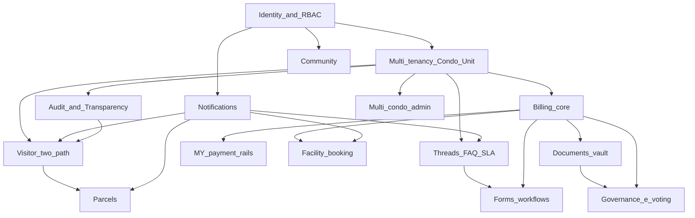
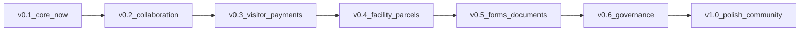

# SmartResidence — Product Roadmap (Master Flow)

> **Status:** living document · **Audience:** maintainers, contributors, the
> product owner · **Horizon:** v0.1 (now) → v1.0
>
> This is the canonical "master flow" for SmartResidence. Every piecemeal
> feature should be traceable back to a milestone here so the product coheres
> instead of accreting. It is deliberately honest about what is **built**,
> what is **in progress**, and what is **planned** — grounded in the actual
> repository (`apps/api/prisma/schema.prisma`, the NestJS modules, the Next.js
> routes, and the Expo app), not aspiration.

---

## 1. Vision & guiding principles

SmartResidence is an open-source, **Malaysia-market-first** condominium /
strata management platform — a modern replacement for closed, slow, ugly
incumbents like eCommunity. It serves three audiences from one backend: a
**mobile app** for residents and security guards, and a **web portal** for
management.

### Guiding principles

1. **Owner empowerment.** The unit owner is the principal, not a bystander.
   Owners control delegated access to their unit, approve who enters, and can
   see everything that touches their unit.
2. **Radical transparency.** Every consequential action is written to an
   immutable audit log scoped to a condo and (where relevant) a unit. Owners
   can literally see *which staff member opened their record and when*
   (already shipped: the "Who viewed my data" page).
3. **Self-hostable OSS.** AGPL-3.0. `make dev` boots the whole stack on
   Docker; a JMB/MC can run it on a cheap VPS. No vendor lock-in.
4. **Malaysia-first.** Strata Management Act 2013 workflows, MYR billing,
   local payment rails (FPX / DuitNow QR / TNG / Boost / GrabPay), WhatsApp
   reach, and BM / English / 中文 (Tamil optional) from the data model up.
5. **Fluid, AirBnB-grade UX.** Generous whitespace, real motion, friendly
   empty states, dark mode, haptics on mobile.
6. **No ads, no dark patterns.** The product is paid for by the people who run
   it, not by selling resident attention. Clean surfaces only.

### Engineering principles (SDLC)

- Every feature ships with **tests** (Vitest unit + Playwright e2e) and must
  pass **typecheck + lint (Biome) + CI** before merge.
- Multi-tenancy is enforced in depth: **Postgres Row-Level Security** +
  application-layer **CASL** abilities (`apps/api/src/auth/abilities`).
- Abilities are **serializable** and shipped to clients via `/api/auth/me` so
  the UI hides what the API would forbid — single source of truth for
  permissions.

---

## 2. Personas & roles

Eight roles exist as a first-class enum (`RoleId`) and drive
role-differentiated navigation already implemented in
`apps/web/src/lib/roles.ts` (areas: `resident` / `admin` / `guard`).

| Role | Scope | Fundamentally CAN | Fundamentally CANNOT |
| --- | --- | --- | --- |
| **SUPER_ADMIN** | Platform | Everything across all condos (`manage all`); operate the multi-condo platform | — |
| **MANAGEMENT_ADMIN** | Condo | Manage their condo: units, billing, defects, announcements, role assignments; configure **SLA policy** and helpdesk settings; **read** audit log; export invoices | Approve/reject visitors (see §2.1); act outside their condo |
| **MANAGEMENT_STAFF** | Condo | Read condo data; update defects; publish announcements; read visitor log; **view** SLA policy (read-only) | Edit SLA policy; manage billing/roles; approve/reject visitors |
| **SECURITY_GUARD** | Condo | Physically **check-in / check-out** visitors; read the expected list | Approve/reject visitors; see billing, defects, resident data |
| **UNIT_OWNER** | Unit | Full control of their unit: pre-register & **approve/reject** visitors, view/pay invoices, raise defects, manage tenancy & household, invite & revoke delegated access, read **their unit's** audit log, **read-only** condo SLA settings audit log | Touch other units or condo-wide config; **edit SLA policy** (management-only; owners may set unit notification prefs elsewhere) |
| **TENANT** | Unit | Most owner powers on the unit they rent (visitors, invoices read, defects, announcements, **open helpdesk threads** — same flow/SLA as owner) | Manage ownership/household; revoke access |
| **HOUSEHOLD_MEMBER** | Unit | Create & view visitors for their unit; read announcements | Pay invoices; manage tenancy; approve walk-ins (owner-only) |
| **CONTRACTOR** | (task) | Read & update defects assigned to them | See unrelated unit/condo data |

### 2.1 Visitor approval rule (CONFIRMED — ✅ shipped)

> **Residents (owner / tenant) are the primary approvers** for walk-ins to
> their unit. Management can **READ / AUDIT** the visitor log but **cannot**
> approve or reject on behalf of a unit.

> **Guard on-site admit (product decision — kept):** guards may **admit a
> walk-in immediately** (`admitNow` / guard discretion) with full audit trail
> (`admittedByGuardUserId`, owner notified for transparency). This is
> intentional on-site discretion — not a management override.

**RBAC ✅ shipped.** `ability.factory.ts` grants `MANAGEMENT_ADMIN` /
`MANAGEMENT_STAFF` **read-only** visitor access in condo scope (plus
overnight-policy / overnight-approve for admins). Owners and tenants get
**explicit** unit-scoped `create`/`read`/`delete`/`approve`/`reject` — not
CASL `manage Visitor` (which would imply gate ops). Guards alone get
`check-in` / `check-out` / `create-walk-in`. Covered by `ability.factory.spec.ts`
and visitor integration tests.

---

## 3. Current state (grounded in the repo)

Legend: ✅ Done · 🟡 In progress · ⬜ Planned

| Module | State | Evidence / notes |
| --- | --- | --- |
| **Identity & auth** | ✅ | `auth/*`: email + OTP, **passkeys** (`PasskeyCredential`), **TOTP 2FA** (`totpService`), sessions, verification codes |
| **RBAC & abilities** | ✅ | 8-role enum; `AbilityFactory` (CASL) with unit/condo-scoped conditions; serialized to clients; role-based routing in web `roles.ts` |
| **Multi-tenancy model** | ✅ | `Condo / Block / Unit / Ownership / Tenancy / HouseholdMember`; Postgres RLS (ADR-0002) |
| **Owner empowerment** | ✅ | `owner/delegated-access` endpoint; **"Who viewed my data"** page (`who-viewed`); per-unit audit reads |
| **Audit log** | ✅ | `AuditLog` + `audit-log.interceptor`; condo/unit/actor scoped; `AuditAction` enum |
| **Visitor — pre-register & QR** | ✅ | `visitor.service`: create + `nanoid` QR + QR PNG; guard check-in/out; mobile guard `scan` / `expected` / `manual` screens |
| **Visitor — two-path / owner approval / access code / offline** | ✅ | Pre-reg fast lane (6-char code + `condoId:visitorId:code` QR), walk-in unit (`PENDING_OWNER_APPROVAL`, 15 min timeout), office immediate check-in; guard offline queue on mobile; management read-only |
| **Billing & payments** | ✅ (core) | `Invoice / InvoiceLine / Payment`; invoice numbering; partial-payment reconciliation; **Stripe + FPX adapters**; pluggable `PaymentProviderAdapter` |
| **Deposits + configurable receipts + unit-type fee schedule** | ✅ | `Deposit`/`Receipt`/`UnitTypeFeeRate`; auto-issued receipt PDFs (no deps); admin `/admin/deposits` + `/admin/settings/billing`; recurring invoices auto-computed from unit-type rate |
| **Accounting ledger + reports** | ✅ | Append-only `LedgerEntry` (fund-tagged) + `UnitAccount` credit; fund balances, collections, arrears aging, unit statement; prepayment auto-apply; `/admin/accounting` |
| **Self-serve payment gateways (Stripe / Fiuu / iPay88)** | ✅ (core) | Per-condo `PaymentGatewayConnection` with AES-256-GCM envelope-encrypted secrets; Stripe live + Fiuu/iPay88 sandbox-ready (signed redirect + callback verify); condo-aware webhooks; resident Pay-now method picker |
| **MY e-wallets (DuitNow QR / TNG / Boost / GrabPay)** | ✅ (DuitNow QR + Fiuu) | **DuitNow QR** first-class adapter + admin gateway UI; **Fiuu (Razer)** is the canonical production path for TNG/Boost/GrabPay/FPX/cards (single merchant contract, hosted checkout); dedicated **Boost/GrabPay adapters cancelled** (product decision); optional **TNG sandbox adapter** only; statement/CSV export still pending |
| **Defects / maintenance** | ✅ | Full lifecycle (`NEW→…→CLOSED/REOPENED`), updates, internal notes, attachments, severity; web + mobile |
| **Communication threads + SLA + AI seam** | ✅ | Core + v0.2 polish shipped (**F3**–**G2**, **D7**, **E1**, **E5**, **G1**, pool editor); **H2** realtime helpdesk (optimistic send, socket cache, live inbox); priority-change reassignment (`assignOnPriorityChange`) + **C6** ML assignment (seam + 200-thread gate + opt-in toggle + persisted Naive Bayes category model via `ml:train-assignment`). Visitor **F1** — see [BACKLOG](./BACKLOG.md) |
| **FAQ knowledge base** | ✅ | `FaqModule` shipped (`apps/api/src/faq/**`): controller/service, admin authoring (`/admin/faq`), resident browse (`/(resident)/faq`) + mobile FAQ, and thread-compose deflection (`POST /faq/deflect-match`) |
| **Announcements** | ✅ | `Announcement` + `AnnouncementAck`; importance, audience JSON, pinned, requiresAck; web admin + resident views |
| **Notifications (push/email)** | ✅ (core) | `Notification` + `PushSubscription` (Expo & Web); notification dispatch in services |
| **Real-time notifications (web toast + bell, mobile push)** | ✅ | Dispatch emits enriched `notification.created` (title/body/data) → gateway forwards `notification:new` to the user room; web in-app toast (`realtime-provider.tsx`) + notification bell w/ unread badge & dropdown (`notification-bell.tsx`) in `app-shell`/`admin-shell`; mobile push registers via authenticated `api.registerPushToken` |
| **Governance-lite polls (owner-verified MC voting)** | ✅ | `PollsModule` (`polls/**`); active-ownership-verified voting; admin `/admin/polls` + resident/mobile polls; migration `20260701160000_owner_polls`. Distinct from AGM/EGM resolution voting (§4.8 governance core) |
| **MCP integrations (admin)** | ✅ | Per-condo `McpServerConnection` (`integrations/**`); admin `/admin/settings/integrations`; CASL `McpServer` subject; migration `20260701180000_mcp_server_connections` |
| **Mobile resident + guard parity** | ✅ | New resident screens (notifications, advance/prepaid payment, polls, recurring passes, FAQ, delegated access) + guard recurring-pass check-in & blacklist alerts |
| **WhatsApp notifications** | ✅ | Per-condo WhatsApp config + `WhatsAppNotificationProvider` (Twilio-backed seam); templates for key flows; admin settings + dispatch fan-out alongside push/email |
| **Storage / attachments** | ✅ | S3-compatible (`storage.service`, `attachments.controller`), MinIO in dev |
| **Realtime** | ✅ | Socket.IO `realtime.gateway`; thread room join/leave; **H2** client wiring — `RealtimeProvider` patches TanStack Query caches on `thread:message` / `thread:update` / `thread:sla` (web + mobile helpdesk); also forwards enriched `notification:new` to per-user rooms (web toast + bell) |
| **Web perf (lite HSR)** | ✅ | **U1** — route-level `loading.tsx` skeletons, nav prefetch, shell retention during auth, `keepPreviousData` on thread lists (commits `ce33631`–`32cd37e`) |
| **Facility booking** | ✅ | `Facility`/`Booking` module; admin `/admin/facilities`; resident booking with deposits → Billing; migration `20260701190000_facility_booking` |
| **Parcels / deliveries** | ✅ | `Parcel`/`ParcelEvent`; guard logging + resident collection sign-off + reminders; admin `/admin/parcels`; migration `20260702120000_parcels` |
| **Governance (AGM/EGM, e-voting, financial transparency, minutes)** | 🟡 | **Core ✅** — meetings, proxy, share-weighted resolution voting, minutes + financial snapshot, **quorum + eligibility + immutable ballot audit**. **Remaining ⬜:** deeper financial/budget transparency views; one-unit-one-vote motion modes (§4.8 / open questions) |
| **Forms & workflows (move-in/out, renovation permit, vehicle sticker)** | ✅ | `FormTemplate`/`FormSubmission` with approval routing; admin `/admin/forms`; migration `20260702130000_forms_workflows` |
| **Community (marketplace, polls, lost & found)** | ✅ | **Polls ✅** (governance-lite owner-verified voting — see row above); **lost & found ✅** — `LostFoundModule`, admin `/admin/lost-found`, resident/mobile, migration `20260702160000_lost_found`, e2e `lost-found.spec.ts`; **marketplace cancelled** (product decision — code removed) |
| **Documents vault** | ✅ | `Document`/`DocumentVersion` with role-scoped visibility; admin `/admin/documents`; migration `20260702140000_documents_vault` |
| **First-time setup wizard** | ✅ | Resumable `/admin/setup` with `setupCompletedAt` / dismiss; dashboard banner + **Finish setup** nav — **no forced redirect** (admins can reach settings/invoices anytime) |
| **Safety / SOS + guard patrol** | ✅ | `SafetyModule` — SOS alerts + patrol rounds/checkpoints; admin `/admin/safety` + `/admin/patrol`; migration `20260701210000_safety_patrol` |
| **Delivery / e-hailing visitor passes** | ✅ | Lighter delivery & e-hailing passes (ties to Visitor + parcels); shipped with visitor module updates in `6dd4f00` / `a4baa2a` |
| **MY e-Invoice (MyInvois)** | ✅ | Production **MyInvois** provider seam + sandbox delegation; admin `/admin/settings/einvoice`; migration `20260701200000_einvoice_myinvois` |
| **Admin / platform (multi-condo super-admin)** | 🟡 | **Basics ✅** — `PlatformModule` + `/admin/platform` condo list/search/detail for `SUPER_ADMIN` (F2 partial). **Still ⬜:** provisioning, plan/usage, feature flags, support impersonation |
| **i18n (BM / EN / 中文 / Tamil)** | 🟡 | `locale` fields on `User` & `Condo`; UI string externalization not complete |

**Surprises worth flagging (more built than expected):**

- The **pluggable local-AI assist seam already exists** — `AI_ASSIST_PROVIDER`
  with a deterministic `RuleBasedAiAssistProvider` that suggests thread
  priority. A future local model is a drop-in replacement.
- A **deterministic SLA engine** (`SlaService`) computing first-response /
  resolution due dates and live SLA state is already present.
- **Passkeys + TOTP 2FA** are already modeled and wired in auth.
- The **FPX adapter** is already scaffolded next to Stripe (not just Stripe).
- The **owner "Who viewed my data"** transparency feature is already shipped.

---

## 4. Module-by-module target design

Dependencies are noted per module. "→" means "depends on / builds atop".

### 4.1 Billing & payments  *(core ✅ → deposits/accounting/gateways ✅ → MY e-wallet rails ⬜)*
- **Target:** maintenance fee + **sinking fund** invoicing per Strata Act;
  itemized, transparent statements; downloadable **receipts**; arrears &
  late-fee formulas (`feeFormulaConfig` on `Condo`, `formula` on
  `InvoiceLine` already exist).
- **Shipped (billing v2 — 3 phases):**
  - **Deposits + receipts + fee schedule:** `Deposit` (renovation/delivery/etc.
    with refund + forfeit), `Receipt` with admin-configurable template
    (`Condo.settings.billing.receipt`) and dependency-free PDF rendering, and a
    per-`UnitType` `UnitTypeFeeRate` that drives `generateRecurring`
    (maintenance + sinking-fund lines computed from unit type × sqft).
  - **Accounting ledger + reports:** append-only fund-tagged `LedgerEntry` +
    `UnitAccount` prepayment credit; advance maintenance auto-applied to invoices;
    fund balances (maintenance/sinking/deposit), collections summary, arrears
    aging, and per-unit statement with running balance (`/admin/accounting`).
  - **Self-serve gateways:** per-condo `PaymentGatewayConnection` with
    **AES-256-GCM envelope-encrypted** credentials (`BILLING_ENCRYPTION_KEY`,
    secrets never returned to the client); **Stripe** live + **Fiuu (Razer)** and
    **iPay88** sandbox-ready adapters (signed redirect + callback/`skey`/SHA256
    verification); condo-aware webhook routing; idempotent settlement that
    auto-issues a receipt and writes the ledger; resident Pay-now method picker;
    admin **gateway capabilities/toggles UI** for per-condo method enablement.
- **MyInvois e-Invoice ✅:** production provider seam (`production-myinvois.provider.ts`)
  with OAuth + document mapping; sandbox delegation; admin `/admin/settings/einvoice`.
- **MY rails:** **DuitNow QR ✅** (dedicated adapter + gateway UI); **Fiuu (Razer) ✅** canonical for TNG/Boost/GrabPay/FPX/cards via hosted checkout (no separate e-wallet contracts for JMBs); dedicated **Boost/GrabPay adapters cancelled** (won't-do); optional **TNG dedicated adapter** remains sandbox-only; statement/CSV export remains pending.
- **Transparency:** unit-level statement view + audit entry on every charge
  adjustment (owner empowerment).
- **Deps:** Identity, Multi-tenancy. **Enables:** Governance financial
  transparency (§4.8).

### 4.2 Visitor management  *(two-path flow ✅)*
The flagship resident-empowerment flow. Two explicit paths:

**(a) Pre-registered fast lane** *(McDonald's-app style):*
1. Owner/tenant pre-registers a visitor → status `APPROVED` up front.
2. Guard sees the **expected list** (mobile `expected` screen exists).
3. Visitor arrives, **scans a QR** *or* enters a **short human-friendly access
   code** (new — `accessCode` field) → guard confirms identity on-device →
   `CHECKED_IN` with minimal friction.

**(b) Walk-in strict path:**
1. Guard gathers visitor info (mobile `manual` screen exists) → status
   `PENDING`.
2. **Owner approval is MANDATORY before entry. NO guard/supervisor override.**
   Strangers must not wander. If the owner doesn't respond, the visitor
   waits or leaves.
3. **Exception:** visitors for the **management office** may enter (logged,
   routed to management) without unit-owner approval.
4. **Every attempt** — approved / rejected / no-response / expired — is logged
   to the **owner's unit activity** feed.

- **Offline tolerance** at the gate: guard device queues check-ins and syncs
  when connectivity returns.
- **RBAC correction ✅ shipped:** management = **read/audit only** (overnight
  review excepted); residents = **only** unit approvers (explicit actions, not
  CASL `manage`); guards = check-in/out / walk-in only (see §2.1).
- **Shipped:** **blacklist** (`VisitorBlacklistService` + web `visitor-blacklist-panel.tsx` + guard blacklist alerts on scan/manual) and **recurring passes** (`RecurringPassService` + resident `visitors/recurring.tsx` + guard recurring-pass check-in); migration `20260701120000_visitor_blacklist_recurring_passes`.
- **Shipped:** lighter **delivery / e-hailing visitor passes** (fast-lane passes
  for couriers/rideshare); **guard on-site admit** for walk-ins (owner notified,
  audited — kept per product decision, see §2.1).
- **Future:** vehicle **plate / ANPR** field (already a `vehiclePlate` column).
- **Deps:** Identity, Notifications (push for approval prompts), Realtime
  (live gate status), Audit. **Strongly pairs with** Communication threads
  (resident↔guard/management context).

### 4.3 Defects / maintenance  *(✅, iterate)*
- **Target additions:** SLA timers (reuse `SlaService`), contractor
  assignment workflow (CONTRACTOR role already scoped), photo evidence
  (attachments exist), resident-visible status timeline.
- **Deps:** Storage, Notifications, (optionally) SLA from Threads.

### 4.4 Communication threads + FAQ + SLA  *(✅ core → deferred polish)*
- **Slack-style** resident↔management threads with categories
  (`ThreadCategory`), `INTERNAL_NOTE` (management-only, never shown to
  residents — already enforced in `threads.service`), assignment, and
  read receipts (`ThreadParticipant`).
- **Deterministic priority + SLA engine:** `RuleBasedAiAssistProvider`
  suggests priority; `SlaService` sets first-response/resolution due dates
  and computes live SLA state + escalation
  (`THREAD_SLA_ESCALATION` notification kind exists).
- **Management FAQ** knowledge base (`FaqCategory / FaqArticle`) ✅ **shipped**:
  `FaqModule` controller/service, admin authoring UI (`/admin/faq`), resident
  browse/search (`/(resident)/faq`) + mobile FAQ, and thread-compose deflection
  (`POST /faq/deflect-match`).
- **Pluggable local-AI seam:** keep `AI_ASSIST_PROVIDER` abstract; future
  local model can answer from FAQ and draft replies — **not built, seam only**.
- **Shipped (v0.2 — partial):** **S1** management-only helpdesk settings on web
  admin + mobile management (`SlaPolicyService`, slider UX, dynamic advisory
  bands, risky-save announcement, grace period, audit log); **M1** resolution
  refinements on D2 (accepted-answer, propose-resolve gate, reject why+what-wanted,
  configurable grace, 14-day inactivity close, household-member confirm, unlimited
  appeals, reopen count badge); **M2** phase-1 auto-assignment (`ThreadAssignmentService`:
  category → pool, GENERAL triage, round-robin, recategorise reassign, repeat
  complainant → senior staff, duplicate suggestions); follow-on polish (**F3**–**G2**,
  **D7**, **E1**, **E5**, **G1**, pool editor); **H2** realtime helpdesk (optimistic
  send, socket → TanStack Query cache, live inbox, assigned-to badge, shared
  `RealtimeProvider` on web + mobile).
- **Also shipped:** priority-change reassignment (`ThreadAssignmentService.assignOnPriorityChange`
  re-routes the assignee on reprioritisation) and the **C6** ML-assignment
  path (`AssignmentAssistProvider` + `ml/ml-assignment.service.ts` + persisted
  category Naive Bayes artifact under `apps/api/ml-models/`, gated by
  `ML_ASSIGNMENT_MIN_CLOSED_THREADS = 200` + an opt-in admin toggle on
  `/admin/settings/helpdesk`; deterministic rules remain fallback).
- **Deps:** Identity, Notifications, Storage, Realtime.

### 4.5 Announcements  *(✅, iterate)*
- **Target additions:** scheduled publish, audience targeting by block/unit
  (audience JSON exists), required-ack reporting, multilingual bodies.
- **Deps:** Notifications, i18n.

### 4.6 Facility booking  *(✅)*
- Bookable amenities: **function hall, BBQ pits, gym, pool, courts, surau**.
- Availability calendar, slot rules, deposits/fees (→ Billing), approval
  policy per facility, cancellation, no-show tracking.
- **Deps:** Billing (deposits), Notifications, Threads (queries about a
  booking). **Sequenced after** Visitor + Threads.

### 4.7 Parcels / deliveries  *(✅)*
- Guardhouse/concierge logs incoming parcels against a unit; resident gets
  notified; collection sign-off; overdue reminders. Lighter "delivery"
  visitor flow ties in (§4.2 future).
- **Deps:** Notifications, Visitor (gate context), Audit.

### 4.8 Governance (AGM/EGM, e-voting, financial transparency, minutes)  *(🟡 core ✅ → deeper financials ⬜)*
- **Shipped (v0.6 core + e-voting slice):** `GovernanceModule` — `GeneralMeeting`
  (AGM/EGM), notice workflow, **proxy** per unit, resolution motions with
  share-weighted e-voting via linked `Poll` (For / Against / Abstain), minutes
  publication + financial snapshot at notice, **`quorumPercent`** + live quorum
  on close, **eligibility** API (owner vs proxy holder), **immutable ballot
  audit** on `PollVote` (`viaProxy` / `proxyId` / `meetingId` / `ownerUserId`) +
  management ballot ledger. Admin `/admin/governance`, resident + mobile
  governance screens; migrations `20260702170000_governance` …
  `20260709120000_governance_agm_evoting`; e2e / integration `governance*.spec.ts`.
- **Still ⬜:** richer **financial/budget transparency** views beyond the notice
  snapshot; optional Documents-vault minutes attachment; one-unit-one-vote
  motion modes (open question).
- **Deps:** Billing (financial transparency), Documents vault (minutes/
  budgets), Identity (eligibility = active ownership). **High-trust — remaining
  gaps in active development.**

### 4.9 Forms & workflows  *(✅)*
- Structured **move-in / move-out**, **renovation permit**, **vehicle
  sticker** applications with approval routing and status tracking.
- **Deps:** Storage (uploads), Notifications, Threads (clarifications),
  Billing (fees/deposits).

### 4.10 Community (marketplace, polls, lost & found)  *(polls ✅ + lost & found ✅)*
- **Shipped:** **governance-lite polls** — `PollsModule` with owner-verified MC
  voting (only active unit owners may vote; ownership + condo checked at vote
  time), admin authoring `/admin/polls`, resident `/(resident)/polls` + mobile
  polls; migration `20260701160000_owner_polls`. Distinct from full AGM/EGM
  resolution voting (§4.8).
- **Shipped:** **lost & found** — `LostFoundModule` (`LostFoundPost` with
  kind/status, photo attachments); admin `/admin/lost-found`, resident
  `/(resident)/lost-found`, mobile `(resident)/lost-found`; migration
  `20260702160000_lost_found`; e2e `lost-found.spec.ts`.
- **Cancelled:** resident-to-resident marketplace (product decision — no ads).
- **Deps:** Identity, Storage, Notifications.

### 4.11 Notifications (push / email / WhatsApp)  *(✅)*
- Channel fan-out per `NotificationKind`; user preferences; quiet hours.
- **Real-time delivery ✅ shipped:** dispatch emits an enriched
  `notification.created` (title/body/data) that `realtime.gateway` forwards as
  `notification:new` to the user's room — web renders an in-app toast
  (`realtime-provider.tsx`) + notification bell with unread badge/dropdown
  (`notification-bell.tsx`); mobile push registers via the authenticated
  `api.registerPushToken`.
- **WhatsApp ✅ shipped:** per-condo provider config + Twilio-backed seam;
  fan-out via the same dispatch interface; `sentChannels` tracked on `Notification`.
- **Deps:** every module emits into it. Cross-cutting.

### 4.12 Access control / security  *(✅ core + PR #5 hardening → UI polish ⬜)*
- Sessions, passkeys, 2FA exist. **Shipped (PR #5, merge `2db9666`):** Helmet
  security headers + CSP (web/mobile), auth endpoint rate limiting (Throttler),
  argon2/TOTP hardening, JWT auth on Socket.IO, Swagger gated to non-prod,
  billing webhook/redirect hardening, dependency patches (lodash/qs/multer/ws
  etc.), and a broad **IDOR remediation pass** across visitor, defects,
  billing/accounting, announcements, FAQ, MCP, parcels, and related controllers.
- **Target (still ⬜):** device/session management UI, anomaly alerts
  (`AUDIT_ALERT` kind exists), guard-device hardening.
- **Deps:** Identity, Audit.

### 4.13 Documents vault  *(✅)*
- Condo-level document library (bylaws, financials, minutes, house rules)
  with role-scoped visibility, versioning, multilingual.
- **Deps:** Storage, RBAC. **Enables:** Governance.

### 4.15 First-time setup wizard  *(✅)*
- Guided `/admin/setup` for fresh deployments: condo profile, structure, billing
  basics, operations toggles, review & finish (`setupCompletedAt` / dismiss).
- **No redirect trap:** incomplete setup surfaces a dashboard banner and **Finish
  setup** nav item; admins can reach settings, invoices, and dismiss the wizard
  without being forced off other admin pages (`admin-shell.tsx`).

### 4.16 Safety / SOS + guard patrol  *(✅)*
- SOS alerts from residents/guards; patrol rounds with checkpoints; admin
  `/admin/safety` and `/admin/patrol`; notifications + audit.

### 4.14 Admin / platform (multi-condo super-admin)  *(🟡 basics ✅)*
- `SUPER_ADMIN` + `manage all` exist. **Shipped (F2 partial):** `PlatformModule`
  + web `/admin/platform` — cross-condo list/search, per-condo detail, setup
  status badges, and "open condo admin" context switch for `SUPER_ADMIN`.
- **Target (still ⬜):** condo provisioning, plan/usage, feature flags, support
  impersonation (audited), aggregate health dashboard.
- **Shipped (admin capability):** **MCP integrations** — per-condo
  `McpServerConnection` (`integrations/**`, `mcp-client.ts`) managed from
  `/admin/settings/integrations`, gated by the CASL `McpServer` subject
  (admin manage / staff read); migration `20260701180000_mcp_server_connections`.
- **Deps:** everything; thin orchestration layer.

---

## 5. Data-model evolution (conceptual)

Existing core entities (do not change semantics):
`User · Session · Condo · Block · Unit · Ownership · Tenancy ·
HouseholdMember · Role · RoleAssignment · Visitor · VisitorCheckIn ·
Invoice · InvoiceLine · Payment · Defect · DefectUpdate · Attachment ·
Announcement · AnnouncementAck · Notification · PushSubscription ·
AuditLog · Thread · ThreadMessage · ThreadParticipant · SlaPolicy ·
FaqCategory · FaqArticle`.

New entities each future module introduces, and how they relate:

| Module | New entities | Relates to |
| --- | --- | --- |
| Visitor v2 | (extend `Visitor` with `accessCode`, `kind` enum PRE_REGISTERED/WALK_IN/MANAGEMENT/DELIVERY; `approvalDeadline`); `VisitorBlacklist`; `RecurringPass` | `Unit`, `User` (host/approver), `VisitorCheckIn` |
| MY payments | `PaymentMethod`/extend `PaymentProvider`; `Statement`, `Receipt` | `Payment`, `Invoice`, `Unit` |
| Facility booking | `Facility`, `FacilitySlot`, `Booking`, `BookingPayment` | `Condo`, `Unit`, `User`, `Invoice` |
| Parcels | `Parcel`, `ParcelEvent` | `Unit`, `User`, `AuditLog` |
| Governance | `GeneralMeeting`, `MeetingProxy`, `MeetingResolution` (+ linked `Poll` for share-weighted votes) | `Condo`, `Ownership` (vote weight via `sharePercent`), `Document` (minutes — pending) |
| Forms | `FormTemplate`, `FormSubmission`, `FormStep`/`Approval` | `Unit`, `User`, `Attachment`, `Invoice` |
| Community | `Poll`, `PollOption`, `PollVote`, `LostFoundPost` | `Condo`, `Unit`, `User`, `Attachment` |
| Documents | `Document`, `DocumentVersion` | `Condo`, `Attachment`, RBAC scope |
| Notifications | `NotificationPreference` | `User`, `NotificationKind` |
| i18n | `Translation`/JSON locale fields | `Announcement`, `FaqArticle`, `Document` |

Principle: new modules attach to the **Condo → Block → Unit → User** spine and
write to the shared **`AuditLog`**; they never bypass RBAC/RLS scoping.

---

## 6. Phased delivery roadmap (v0.1 → v1.0)

Ordering rationale: finish **collaboration + trust** primitives (threads,
visitor approval) before convenience modules (facility booking, parcels),
and defer **high-trust governance / e-voting** until billing transparency and
a documents vault exist.

### Dependency graph

### Milestone timeline

### v0.1 — Core foundations  *(✅ done / 🟡 finishing)*
- **Delivers:** auth (OTP/passkeys/2FA), RBAC + abilities, multi-tenancy,
  audit + owner transparency, visitor pre-register + guard check-in/out,
  billing core (Stripe/FPX), defects, announcements, push/email
  notifications, storage, realtime.
- **Deps:** none. **Acceptance:** resident can view/pay an invoice, raise a
  defect, pre-register a visitor; guard can check a visitor in; management can
  publish an announcement; all paths covered by Vitest + a Playwright happy
  path; typecheck/lint/CI green.

### v0.2 — Collaboration: Threads + FAQ + SLA  *(✅ done — partial)*
- **Delivers (shipped):** `ThreadsModule` wired; D2 resident-driven resolution +
  H1 helpdesk dashboard polish; **S1** SLA settings panel (web admin + mobile
  management); **M1** enhanced resolution flow; **M2** phase-1 thread
  auto-assignment; SLA escalation notifications; AI-assist seam kept pluggable;
  follow-on messaging polish (**F3**–**G2**, **D7**, **E1**, **E5**, **G1**);
  **H2** realtime helpdesk; **U1** web perf (**lite HSR** — skeletons + prefetch).
- **Done (partial) — S1 / M1 / M2 / H2 / U1** (messaging spec decision-complete;
  see [docs/BACKLOG.md](./BACKLOG.md)):
  - **S1** ✅ — slider-based `SlaPolicy` editing, dynamic advisory bands, risky-save
    announcement, grace period, 24/7 clock, open-thread recalc, pool editor, owner
    SLA audit page (G1), quiet hours (E5).
  - **M1** ✅ — accepted-answer, propose-resolve gate, reject why+what-wanted,
    tenant threads, 14-day inactivity close, household confirm, appeals/reopen badge,
    abusive-thread close (D7), email opt-in (E1).
  - **M2** ✅ (phase 1) — category → assignee pool, triage pool, recategorise
    reassign, repeat complainant routing, duplicate suggestions, inbox sort (F3),
    FAQ deflection (F4), PDF export (G2), plus priority-change reassignment
    (`assignOnPriorityChange`). ML phase 2 (**C6**) trained category model shipped
    (200-thread gate + opt-in toggle + `ml:train-assignment` artifact); rules remain fallback.
  - **H2** ✅ — optimistic message send, Socket.IO cache patches, live inbox,
    assigned-to badge; `RealtimeProvider` on web + mobile. **Shipped:** `299531f`.
  - **U1** ✅ — **lite HSR**: route `loading.tsx` skeletons, nav prefetch,
    shell retention, `keepPreviousData` on thread lists. **Shipped:** `ce33631`
    (+ CI `f92d6ae`, `32cd37e`; green run `27017382927`).
- **FAQ (original v0.2 scope) ✅ now shipped:** `FaqModule` + admin authoring
  (`/admin/faq`) + resident/mobile browse (`/(resident)/faq`) + compose-time
  deflection (`POST /faq/deflect-match`).
- **Deps:** Identity, Notifications. **Acceptance:** resident opens a thread,
  management replies (with internal notes hidden from residents), priority
  auto-suggested, SLA due dates computed, escalation fires; FAQ searchable;
  unit + e2e tests; CI green.

### v0.3 — Visitor v2 + Malaysia payment rails  *(✅ visitor + RBAC done — MY rail polish ⬜)*
- **Delivers:** two-path visitor flow (fast-lane QR/access-code + strict
  walk-in with **mandatory owner approval, no override**, management-office
  exception, full unit-activity logging, offline tolerance); **apply the RBAC
  correction** (management read/audit only); DuitNow QR; Malaysian e-wallets via
  **Fiuu (Razer)** aggregator; itemized statements + receipts.
- **Shipped (visitor polish — V3):** share pass (replaces regenerate); holiday
  auto-approve toggle + MY public holidays in settings; guard unit search picker
  (web + mobile); visitor/helpdesk i18n wiring (en/ms/zh-Hans); admin overnight
  queue filters; Windows `db:migrate` fix. **Shipped (MY rails):** DuitNow QR
  adapter + gateway UI; **Fiuu** as canonical path for TNG/Boost/GrabPay/FPX/cards.
  **Product decision:** dedicated Boost/GrabPay adapters **cancelled** (use Fiuu);
  optional TNG sandbox adapter only. **Shipped (RBAC):** management read/audit only — see §2.1.
  **Still ⬜:** statement/CSV export polish.
- **Deps:** Threads (context), Notifications, Audit, Billing core.
  **Acceptance:** walk-in cannot enter without owner approval; no
  guard/supervisor override path exists; management office visitor allowed &
  logged; every attempt appears in the owner's activity; resident pays via a
  MY e-wallet sandbox; statement/receipt downloadable; tests + CI green.

### v0.4 — Facility booking + Parcels
- **Delivers:** facility calendar/booking with deposits (→ Billing); parcel
  logging + collection sign-off + reminders.
- **Deps:** Billing, Notifications, Visitor. **Acceptance:** resident books a
  facility (deposit invoiced), double-booking prevented; guard logs a parcel,
  resident notified and signs off; tests + CI green.

### v0.5 — Forms & workflows + Documents vault
- **Delivers:** move-in/out, renovation permit, vehicle sticker forms with
  approval routing; condo documents library with role-scoped visibility +
  versioning.
- **Deps:** Storage, Threads, Billing. **Acceptance:** a renovation permit
  flows submit→review→approve with audit trail; documents visible per role;
  tests + CI green.

### v0.6 — Governance: AGM/EGM + e-voting + financial transparency  *(🟡 core ✅)*
- **Delivers:** meeting notices, proxy, share-weighted e-voting, audited
  financial/budget views, minutes publication.
- **Shipped (core):** `GovernanceModule` — AGM/EGM meetings, notice workflow,
  proxy per unit, resolution motions with share-weighted e-voting (For/Against/
  Abstain via linked `Poll`); admin + resident + mobile UI; migration
  `20260702170000_governance`; e2e `governance.spec.ts`.
- **Still ⬜:** **minutes publication** (→ Documents vault) and **financial/
  budget transparency** views (→ Billing ledger/reports). In active development.
- **Deps:** Documents vault, Billing transparency, Identity (eligibility).
  **Acceptance:** an AGM motion runs end-to-end with verifiable share-weighted
  tally, proxy honored, results immutable in audit; financial summary matches
  ledger; minutes published; tests + CI green.

### v1.0 — Polish, Community, multi-condo platform, WhatsApp, full i18n
- **Delivers:** community (marketplace/polls/lost&found), WhatsApp channel,
  multi-condo super-admin console, complete BM/EN/中文 (Tamil optional)
  localization, accessibility & performance pass, self-hosting hardening.
- **Already shipped toward v1.0:** polls + lost & found (§4.10), WhatsApp
  notifications (§4.11), platform console basics `/admin/platform` (F2
  partial, §4.14), PR #5 security hardening (§4.12). Marketplace cancelled.
- **Deps:** broad. **Acceptance:** a JMB self-hosts and runs a full month
  (billing cycle, AGM, visitors, defects) in their language; Lighthouse/
  a11y targets met; tests + CI green.

---

## 7. Cross-cutting concerns

- **i18n:** BM / English / 中文 (Tamil optional). `locale` already on `User`
  and `Condo`; externalize all UI strings; translate user-authored content
  (announcements, FAQ, documents).
- **Accessibility:** WCAG AA targets; keyboard nav on web; screen-reader
  labels; sufficient contrast (no decorative-only color coding).
- **Offline tolerance:** the gate (guard device) must queue and sync;
  resident app degrades gracefully.
- **Security & PDPA:** Malaysia PDPA compliance — data minimization, consent
  for visitor data, retention limits, export/delete; RLS + CASL defense in
  depth; passkeys/2FA.
- **Audit & transparency:** every consequential action audited; owners can see
  reads of their unit data ("Who viewed my data" already shipped).
- **Performance:** RSC on web, list pagination everywhere (DTOs already use
  limit/offset), DB indexes present on hot paths; mobile uses Reanimated for
  60fps. **Lite HSR** (U1): keep app chrome visible, show route-level shimmer
  skeletons during transitions, prefetch nav targets on hover/mount so warm
  navigations feel instant without full streaming SSR.
- **Observability:** request IDs (`request-id.middleware`), structured logs,
  health checks (`health` module); **Prometheus scrape endpoint** (`GET /metrics`,
  gated by `METRICS_ENABLED=true` + localhost) for uptime, heap, request count,
  and Postgres/Redis health; OpenTelemetry traces still deferred pre-v1.0.
- **Self-hosting:** Docker compose + Helm chart; `make dev`; demo seed; keep
  external services optional/swappable.
- **Pluggable local-AI seam:** `AI_ASSIST_PROVIDER` stays an interface; the
  default `RuleBasedAiAssistProvider` is deterministic and offline. Any future
  local model is opt-in and never a hard dependency.

---

## 8. Out-of-scope / deferred & open questions

### Explicitly deferred (post-v1.0 or non-goals)
- Cloud-only SaaS exclusive features; anything requiring closed-source
  services as a hard dependency.
- Advertising, attention-monetization, or selling resident data — **never**.
- Heavy/cloud LLM dependence; only the optional, pluggable local seam.
- IoT/hardware turnstile & full ANPR camera integration (field reserved on
  `Visitor`; integration is future hardware work).
- Native accounting-suite replacement (export/integrate instead).

### Decided — messaging module (Rounds 1–3, locked — decision-complete)

See [docs/BACKLOG.md](./BACKLOG.md) S1 / M1 / M2 for full detail. No open
messaging questions remain.

| ID | Decision |
| --- | --- |
| **A1** | Dynamic risky bands based on condo size / unit count |
| **A2** | Auto-publish announcement immediately when saving risky SLA |
| **A3** | `MANAGEMENT_ADMIN` only can edit SLA; staff read-only |
| **A4** | All open threads — recalculate due dates on SLA change |
| **A5** | Resolution slider per priority; first-response auto-derived at 40% (single slider UX, two stored values) |
| **A6** | Fixed 20% AT_RISK threshold |
| **A7** | Breach notifications: assignee + all management |
| **A8** | Normal-band saves: audit log only, no resident announcement |
| **A9** | No one-click rollback — manual re-enter only |
| **A10** | Default grace period: 7 days (configurable in S1 settings) |
| **B1** | Specific management message marked as proposed solution (Stack Overflow style) |
| **B2** | Management can change proposed-solution message anytime while `PENDING_RESIDENT_CONFIRMATION` |
| **B3** | Reject requires why rejecting AND what they still want (freeform) |
| **B4** | "Silent" = no resident message since last management message |
| **B5** | No general gate on propose-resolve — not blocked by resident silence; anytime after mgmt responded (see B6, B13) |
| **B6** | Management can propose-resolve after they've responded, even if resident never replied |
| **B7** | Auto-confirm → `RESOLVED` status |
| **B8** | After auto-confirm `RESOLVED`, same appeal rules apply (required reason, unlimited) |
| **B9** | Unlimited reopens/appeals |
| **B10** | Required reason text on reopen/appeal |
| **B11** | Appeal/reopen notifies original assignee only |
| **B12** | SLA continues from original due date on reopen (no reset) |
| **B13** | Sole exception to B5: block propose-resolve while `AWAITING_RESIDENT` |
| **B15** | Any new resident message on `RESOLVED` auto-reopens (keep current) |
| **C1** | "Other" category → general/triage assignee pool (S1 configurable); phase 1: category → assignee pool |
| **C2** | Unassigned fallback: notify all management |
| **C3** | Any management user can reassign |
| **C4** | Recategorise → auto-reassign to new category pool immediately |
| **C5** | No VIP unit routing; repeat complainants (3+ threads/30 days) → senior staff + header flag |
| **C6** | ML phase 2 at 200+ closed threads per condo, opt-in feature flag; rules remain fallback |
| **D1** | `TENANT` can open threads — same flow/SLA as owner |
| **D2** | Any household member linked to unit can confirm resolution |
| **D3** | Internal notes never visible to residents; push/email previews must not leak |
| **D4** | `AWAITING_RESIDENT` — SLA clock continues (no pause) |
| **D5** | System suggests possible duplicate threads; management decides (no hard merge in v0.2) |
| **D6** | Auto-close after 14 days total inactivity (both sides silent) |
| **D7** | Management can flag + close abusive threads with reason; resident notified |
| **D9** | SLA clock runs 24/7 |
| **D10** | Priority override recalculates SLA due date immediately |
| **E1** | Default: in-app + mobile push; user can opt-in to email |
| **E2** | Every management reply → immediate in-app + push (no digest in v0.2) |
| **E5** | Fully user-configurable quiet hours in resident profile |
| **F1** | SLA settings panel on web admin **and mobile management** in v0.2 |
| **F3** | Inbox default sort: SLA breach → AT_RISK → priority → oldest |
| **F4** | FAQ deflection: strong match offers "This answered my question" to close without thread |
| **G1** | `UNIT_OWNER` read-only access to SLA audit log |
| **G2** | PDF export: management + resident can export own threads (v0.2) |
| **G3** | Show reopen count badge on thread header for management |

### Open questions for the product owner (other modules)

1. ~~**MY payment priority:**~~ **Decided:** **Fiuu (Razer)** is the canonical
   e-wallet path for production JMBs (TNG/Boost/GrabPay via one merchant
   contract); **DuitNow QR** remains a dedicated first-class rail; dedicated
   Boost/GrabPay adapters won't be built.
2. **Walk-in no-response policy:** exact owner-approval timeout (e.g. 5 min)
   and what the visitor sees — silent expiry vs explicit "denied"?
3. **Management-office exception:** which roles/users count as "management
   office" recipients, and should such entries notify a specific desk?
4. **Vote weighting:** is e-voting strictly `sharePercent`-weighted, or
   one-unit-one-vote for certain motions (Strata Act nuance)?
5. **WhatsApp provider:** Twilio vs Meta Cloud API vs a local MY gateway —
   cost/deliverability trade-off in Malaysia?
6. **Tamil scope:** ship Tamil at v1.0 or treat as community-contributed
   stretch?
7. **Contractor onboarding:** self-serve invite vs management-provisioned
   only?
8. **Sinking-fund accounting:** how strictly must statements mirror Strata Act
   prescribed formats / audited fund separation?

---

*Maintained as the master flow. When you add a feature, update the relevant
module section (§4), the data-model table (§5), and the milestone it lands in
(§6). Keep the current-state table (§3) honest.*
