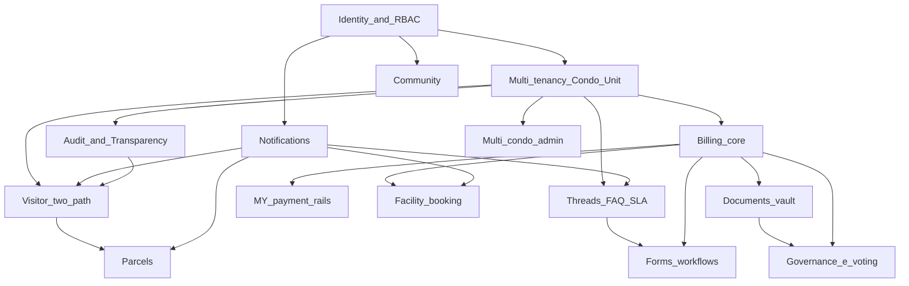
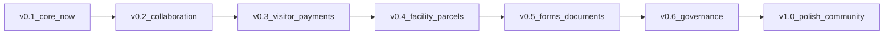

# SmartResidence — Product Roadmap (Master Flow)

> **Status:** living document · **Audience:** maintainers, contributors, the
> product owner · **Horizon:** v0.1 (now) → v1.0
>
> This is the canonical "master flow" for SmartResidence. Every piecemeal
> feature should be traceable back to a milestone here so the product coheres
> instead of accreting. It is deliberately honest about what is **built**,
> what is **in progress**, and what is **planned** — grounded in the actual
> repository (`apps/api/prisma/schema.prisma`, the NestJS modules, the Next.js
> routes, and the Expo app), not aspiration.

---

## 1. Vision & guiding principles

SmartResidence is an open-source, **Malaysia-market-first** condominium /
strata management platform — a modern replacement for closed, slow, ugly
incumbents like eCommunity. It serves three audiences from one backend: a
**mobile app** for residents and security guards, and a **web portal** for
management.

### Guiding principles

1. **Owner empowerment.** The unit owner is the principal, not a bystander.
   Owners control delegated access to their unit, approve who enters, and can
   see everything that touches their unit.
2. **Radical transparency.** Every consequential action is written to an
   immutable audit log scoped to a condo and (where relevant) a unit. Owners
   can literally see *which staff member opened their record and when*
   (already shipped: the "Who viewed my data" page).
3. **Self-hostable OSS.** AGPL-3.0. `make dev` boots the whole stack on
   Docker; a JMB/MC can run it on a cheap VPS. No vendor lock-in.
4. **Malaysia-first.** Strata Management Act 2013 workflows, MYR billing,
   local payment rails (FPX / DuitNow QR / TNG / Boost / GrabPay), WhatsApp
   reach, and BM / English / 中文 (Tamil optional) from the data model up.
5. **Fluid, AirBnB-grade UX.** Generous whitespace, real motion, friendly
   empty states, dark mode, haptics on mobile.
6. **No ads, no dark patterns.** The product is paid for by the people who run
   it, not by selling resident attention. Clean surfaces only.

### Engineering principles (SDLC)

- Every feature ships with **tests** (Vitest unit + Playwright e2e) and must
  pass **typecheck + lint (Biome) + CI** before merge.
- Multi-tenancy is enforced in depth: **Postgres Row-Level Security** +
  application-layer **CASL** abilities (`apps/api/src/auth/abilities`).
- Abilities are **serializable** and shipped to clients via `/api/auth/me` so
  the UI hides what the API would forbid — single source of truth for
  permissions.

---

## 2. Personas & roles

Eight roles exist as a first-class enum (`RoleId`) and drive
role-differentiated navigation already implemented in
`apps/web/src/lib/roles.ts` (areas: `resident` / `admin` / `guard`).

| Role | Scope | Fundamentally CAN | Fundamentally CANNOT |
| --- | --- | --- | --- |
| **SUPER_ADMIN** | Platform | Everything across all condos (`manage all`); operate the multi-condo platform | — |
| **MANAGEMENT_ADMIN** | Condo | Manage their condo: units, billing, defects, announcements, role assignments; **read** audit log; export invoices | Approve/reject visitors (see §2.1); act outside their condo |
| **MANAGEMENT_STAFF** | Condo | Read condo data; update defects; publish announcements; read visitor log | Manage billing/roles; approve/reject visitors |
| **SECURITY_GUARD** | Condo | Physically **check-in / check-out** visitors; read the expected list | Approve/reject visitors; see billing, defects, resident data |
| **UNIT_OWNER** | Unit | Full control of their unit: pre-register & **approve/reject** visitors, view/pay invoices, raise defects, manage tenancy & household, invite & revoke delegated access, read **their unit's** audit log | Touch other units or condo-wide config |
| **TENANT** | Unit | Most owner powers on the unit they rent (visitors, invoices read, defects, announcements) | Manage ownership/household; revoke access |
| **HOUSEHOLD_MEMBER** | Unit | Create & view visitors for their unit; read announcements | Pay invoices; manage tenancy; approve walk-ins (owner-only) |
| **CONTRACTOR** | (task) | Read & update defects assigned to them | See unrelated unit/condo data |

### 2.1 Visitor approval rule (CONFIRMED — correction pending)

> **Only RESIDENTS (owner / tenant) approve or reject visitors for their own
> unit.** Management can **READ / AUDIT** the visitor log but **cannot**
> approve or reject. Guards perform **physical check-in / check-out only**.

⚠️ **Current code does not yet match this.** Today `ability.factory.ts` grants
`MANAGEMENT_ADMIN` `manage Visitor` and `MANAGEMENT_STAFF` `approve Visitor`.
This is the corrected rule to apply in the visitor-management milestone
(post-threads): remove management approve/reject, keep read/audit, keep guard
check-in/out, and keep resident approve/reject as the only approval path.

---

## 3. Current state (grounded in the repo)

Legend: ✅ Done · 🟡 In progress · ⬜ Planned

| Module | State | Evidence / notes |
| --- | --- | --- |
| **Identity & auth** | ✅ | `auth/*`: email + OTP, **passkeys** (`PasskeyCredential`), **TOTP 2FA** (`totpService`), sessions, verification codes |
| **RBAC & abilities** | ✅ | 8-role enum; `AbilityFactory` (CASL) with unit/condo-scoped conditions; serialized to clients; role-based routing in web `roles.ts` |
| **Multi-tenancy model** | ✅ | `Condo / Block / Unit / Ownership / Tenancy / HouseholdMember`; Postgres RLS (ADR-0002) |
| **Owner empowerment** | ✅ | `owner/delegated-access` endpoint; **"Who viewed my data"** page (`who-viewed`); per-unit audit reads |
| **Audit log** | ✅ | `AuditLog` + `audit-log.interceptor`; condo/unit/actor scoped; `AuditAction` enum |
| **Visitor — pre-register & QR** | ✅ | `visitor.service`: create + `nanoid` QR + QR PNG; guard check-in/out; mobile guard `scan` / `expected` / `manual` screens |
| **Visitor — two-path / owner approval / access code / offline** | ⬜ | `create()` currently **auto-approves** (`status: APPROVED`, host == approver); no walk-in approval gate, no short access code, no offline tolerance |
| **Billing & payments** | ✅ (core) | `Invoice / InvoiceLine / Payment`; invoice numbering; partial-payment reconciliation; **Stripe + FPX adapters**; pluggable `PaymentProviderAdapter` |
| **MY e-wallets (DuitNow QR / TNG / Boost / GrabPay) + receipts/statements** | ⬜ | `PaymentProvider` enum has STRIPE/FPX/IPAY88/RAZER/MANUAL; e-wallet adapters & itemized statement/receipt PDFs not built |
| **Defects / maintenance** | ✅ | Full lifecycle (`NEW→…→CLOSED/REOPENED`), updates, internal notes, attachments, severity; web + mobile |
| **Communication threads + SLA + AI seam** | 🟡 | Schema (`Thread / ThreadMessage / ThreadParticipant / SlaPolicy`) + `threads` module (controller, service, `SlaService`, `RuleBasedAiAssistProvider`) **exist but the module is not yet wired into `app.module.ts`** |
| **FAQ knowledge base** | 🟡 | Schema (`FaqCategory / FaqArticle`) present; **no FAQ controller/service/module yet** |
| **Announcements** | ✅ | `Announcement` + `AnnouncementAck`; importance, audience JSON, pinned, requiresAck; web admin + resident views |
| **Notifications (push/email)** | ✅ (core) | `Notification` + `PushSubscription` (Expo & Web); notification dispatch in services |
| **WhatsApp notifications** | ⬜ | Twilio is in the stack/README but no WhatsApp channel implemented |
| **Storage / attachments** | ✅ | S3-compatible (`storage.service`, `attachments.controller`), MinIO in dev |
| **Realtime** | ✅ | Socket.IO `realtime.gateway`; events emitted across modules |
| **Facility booking** | ⬜ | Not in schema or code |
| **Parcels / deliveries** | ⬜ | Not in schema or code |
| **Governance (AGM/EGM, e-voting, financial transparency, minutes)** | ⬜ | Not in schema or code |
| **Forms & workflows (move-in/out, renovation permit, vehicle sticker)** | ⬜ | Not in schema or code |
| **Community (marketplace, polls, lost & found)** | ⬜ | Not in schema or code |
| **Documents vault** | ⬜ | Not in schema or code (attachments exist as primitive) |
| **Admin / platform (multi-condo super-admin)** | 🟡 | `SUPER_ADMIN` role + `manage all` ability exist; no dedicated cross-condo console UI yet |
| **i18n (BM / EN / 中文 / Tamil)** | 🟡 | `locale` fields on `User` & `Condo`; UI string externalization not complete |

**Surprises worth flagging (more built than expected):**

- The **pluggable local-AI assist seam already exists** — `AI_ASSIST_PROVIDER`
  with a deterministic `RuleBasedAiAssistProvider` that suggests thread
  priority. A future local model is a drop-in replacement.
- A **deterministic SLA engine** (`SlaService`) computing first-response /
  resolution due dates and live SLA state is already present.
- **Passkeys + TOTP 2FA** are already modeled and wired in auth.
- The **FPX adapter** is already scaffolded next to Stripe (not just Stripe).
- The **owner "Who viewed my data"** transparency feature is already shipped.

---

## 4. Module-by-module target design

Dependencies are noted per module. "→" means "depends on / builds atop".

### 4.1 Billing & payments  *(core ✅ → MY rails ⬜)*
- **Target:** maintenance fee + **sinking fund** invoicing per Strata Act;
  itemized, transparent statements; downloadable **receipts**; arrears &
  late-fee formulas (`feeFormulaConfig` on `Condo`, `formula` on
  `InvoiceLine` already exist).
- **MY rails:** add adapters for **DuitNow QR**, **TNG eWallet**, **Boost**,
  **GrabPay** behind the existing `PaymentProviderAdapter`; webhook
  reconciliation already modeled via `markPaymentSucceeded(providerRef)`.
- **Transparency:** unit-level statement view + audit entry on every charge
  adjustment (owner empowerment).
- **Deps:** Identity, Multi-tenancy. **Enables:** Governance financial
  transparency (§4.8).

### 4.2 Visitor management  *(two-path flow — next major)*
The flagship resident-empowerment flow. Two explicit paths:

**(a) Pre-registered fast lane** *(McDonald's-app style):*
1. Owner/tenant pre-registers a visitor → status `APPROVED` up front.
2. Guard sees the **expected list** (mobile `expected` screen exists).
3. Visitor arrives, **scans a QR** *or* enters a **short human-friendly access
   code** (new — `accessCode` field) → guard confirms identity on-device →
   `CHECKED_IN` with minimal friction.

**(b) Walk-in strict path:**
1. Guard gathers visitor info (mobile `manual` screen exists) → status
   `PENDING`.
2. **Owner approval is MANDATORY before entry. NO guard/supervisor override.**
   Strangers must not wander. If the owner doesn't respond, the visitor
   waits or leaves.
3. **Exception:** visitors for the **management office** may enter (logged,
   routed to management) without unit-owner approval.
4. **Every attempt** — approved / rejected / no-response / expired — is logged
   to the **owner's unit activity** feed.

- **Offline tolerance** at the gate: guard device queues check-ins and syncs
  when connectivity returns.
- **Correction to apply:** management = **read/audit only**; residents =
  **only** approvers; guards = check-in/out only (see §2.1).
- **Future:** vehicle **plate / ANPR** field (already a `vehiclePlate`
  column), **blacklist**, **recurring passes**, lighter **deliveries /
  e-hailing** flow.
- **Deps:** Identity, Notifications (push for approval prompts), Realtime
  (live gate status), Audit. **Strongly pairs with** Communication threads
  (resident↔guard/management context).

### 4.3 Defects / maintenance  *(✅, iterate)*
- **Target additions:** SLA timers (reuse `SlaService`), contractor
  assignment workflow (CONTRACTOR role already scoped), photo evidence
  (attachments exist), resident-visible status timeline.
- **Deps:** Storage, Notifications, (optionally) SLA from Threads.

### 4.4 Communication threads + FAQ + SLA  *(🟡 finish & wire up)*
- **Slack-style** resident↔management threads with categories
  (`ThreadCategory`), `INTERNAL_NOTE` (management-only, never shown to
  residents — already enforced in `threads.service`), assignment, and
  read receipts (`ThreadParticipant`).
- **Deterministic priority + SLA engine:** `RuleBasedAiAssistProvider`
  suggests priority; `SlaService` sets first-response/resolution due dates
  and computes live SLA state + escalation
  (`THREAD_SLA_ESCALATION` notification kind exists).
- **Management FAQ** knowledge base (`FaqCategory / FaqArticle`): build the
  controller/service/module + admin authoring UI + resident browse/search
  (Prisma `fullTextSearch` preview is enabled).
- **Pluggable local-AI seam:** keep `AI_ASSIST_PROVIDER` abstract; future
  local model can answer from FAQ and draft replies — **not built, seam only**.
- **Immediate finishing work:** register `ThreadsModule` in `app.module.ts`;
  ship FAQ module; add tests.
- **Deps:** Identity, Notifications, Storage, Realtime.

### 4.5 Announcements  *(✅, iterate)*
- **Target additions:** scheduled publish, audience targeting by block/unit
  (audience JSON exists), required-ack reporting, multilingual bodies.
- **Deps:** Notifications, i18n.

### 4.6 Facility booking  *(⬜)*
- Bookable amenities: **function hall, BBQ pits, gym, pool, courts, surau**.
- Availability calendar, slot rules, deposits/fees (→ Billing), approval
  policy per facility, cancellation, no-show tracking.
- **Deps:** Billing (deposits), Notifications, Threads (queries about a
  booking). **Sequenced after** Visitor + Threads.

### 4.7 Parcels / deliveries  *(⬜)*
- Guardhouse/concierge logs incoming parcels against a unit; resident gets
  notified; collection sign-off; overdue reminders. Lighter "delivery"
  visitor flow ties in (§4.2 future).
- **Deps:** Notifications, Visitor (gate context), Audit.

### 4.8 Governance (AGM/EGM, e-voting, financial transparency, minutes)  *(⬜)*
- AGM/EGM **notices** (→ Announcements), **proxy** assignment, **e-voting**
  (one vote per share/`sharePercent` already on `Ownership`), **audited
  financials / budget transparency**, **minutes** publication.
- **Deps:** Billing (financial transparency), Documents vault (minutes/
  budgets), Identity (eligibility = active ownership). **High-trust — late
  milestone.**

### 4.9 Forms & workflows  *(⬜)*
- Structured **move-in / move-out**, **renovation permit**, **vehicle
  sticker** applications with approval routing and status tracking.
- **Deps:** Storage (uploads), Notifications, Threads (clarifications),
  Billing (fees/deposits).

### 4.10 Community (marketplace, polls, lost & found)  *(⬜)*
- Resident-to-resident marketplace, lightweight polls (distinct from formal
  e-voting), lost & found board. **No ads** — community utility only.
- **Deps:** Identity, Storage, Notifications.

### 4.11 Notifications (push / email / WhatsApp)  *(✅ push+email → ⬜ WhatsApp)*
- Channel fan-out per `NotificationKind`; user preferences; quiet hours.
- **WhatsApp** channel (huge MY reach) via Twilio/provider behind the same
  dispatch interface; `sentChannels` already tracked on `Notification`.
- **Deps:** every module emits into it. Cross-cutting.

### 4.12 Access control / security  *(✅ core → harden)*
- Sessions, passkeys, 2FA exist. **Target:** device/session management UI,
  anomaly alerts (`AUDIT_ALERT`), rate-limit tuning (Throttler is wired),
  guard-device hardening.
- **Deps:** Identity, Audit.

### 4.13 Documents vault  *(⬜)*
- Condo-level document library (bylaws, financials, minutes, house rules)
  with role-scoped visibility, versioning, multilingual.
- **Deps:** Storage, RBAC. **Enables:** Governance.

### 4.14 Admin / platform (multi-condo super-admin)  *(🟡)*
- `SUPER_ADMIN` + `manage all` exist. **Target:** cross-condo console —
  provisioning condos, plan/usage, feature flags, support impersonation
  (audited), aggregate health.
- **Deps:** everything; thin orchestration layer.

---

## 5. Data-model evolution (conceptual)

Existing core entities (do not change semantics):
`User · Session · Condo · Block · Unit · Ownership · Tenancy ·
HouseholdMember · Role · RoleAssignment · Visitor · VisitorCheckIn ·
Invoice · InvoiceLine · Payment · Defect · DefectUpdate · Attachment ·
Announcement · AnnouncementAck · Notification · PushSubscription ·
AuditLog · Thread · ThreadMessage · ThreadParticipant · SlaPolicy ·
FaqCategory · FaqArticle`.

New entities each future module introduces, and how they relate:

| Module | New entities | Relates to |
| --- | --- | --- |
| Visitor v2 | (extend `Visitor` with `accessCode`, `kind` enum PRE_REGISTERED/WALK_IN/MANAGEMENT/DELIVERY; `approvalDeadline`); `VisitorBlacklist`; `RecurringPass` | `Unit`, `User` (host/approver), `VisitorCheckIn` |
| MY payments | `PaymentMethod`/extend `PaymentProvider`; `Statement`, `Receipt` | `Payment`, `Invoice`, `Unit` |
| Facility booking | `Facility`, `FacilitySlot`, `Booking`, `BookingPayment` | `Condo`, `Unit`, `User`, `Invoice` |
| Parcels | `Parcel`, `ParcelEvent` | `Unit`, `User`, `AuditLog` |
| Governance | `Meeting`, `Motion`, `Vote`, `Proxy`, `Resolution` | `Condo`, `Ownership` (vote weight via `sharePercent`), `Document` |
| Forms | `FormTemplate`, `FormSubmission`, `FormStep`/`Approval` | `Unit`, `User`, `Attachment`, `Invoice` |
| Community | `Listing`, `Poll`, `PollOption`, `PollVote`, `LostFoundItem` | `Condo`, `Unit`, `User`, `Attachment` |
| Documents | `Document`, `DocumentVersion` | `Condo`, `Attachment`, RBAC scope |
| Notifications | `NotificationPreference` | `User`, `NotificationKind` |
| i18n | `Translation`/JSON locale fields | `Announcement`, `FaqArticle`, `Document` |

Principle: new modules attach to the **Condo → Block → Unit → User** spine and
write to the shared **`AuditLog`**; they never bypass RBAC/RLS scoping.

---

## 6. Phased delivery roadmap (v0.1 → v1.0)

Ordering rationale: finish **collaboration + trust** primitives (threads,
visitor approval) before convenience modules (facility booking, parcels),
and defer **high-trust governance / e-voting** until billing transparency and
a documents vault exist.

### Dependency graph

### Milestone timeline

### v0.1 — Core foundations  *(✅ done / 🟡 finishing)*
- **Delivers:** auth (OTP/passkeys/2FA), RBAC + abilities, multi-tenancy,
  audit + owner transparency, visitor pre-register + guard check-in/out,
  billing core (Stripe/FPX), defects, announcements, push/email
  notifications, storage, realtime.
- **Deps:** none. **Acceptance:** resident can view/pay an invoice, raise a
  defect, pre-register a visitor; guard can check a visitor in; management can
  publish an announcement; all paths covered by Vitest + a Playwright happy
  path; typecheck/lint/CI green.

### v0.2 — Collaboration: Threads + FAQ + SLA  *(🟡 in progress now)*
- **Delivers:** wire `ThreadsModule` into `app.module.ts`; FAQ module + admin
  authoring + resident search; SLA escalation notifications; AI-assist seam
  kept pluggable.
- **Deps:** Identity, Notifications. **Acceptance:** resident opens a thread,
  management replies (with internal notes hidden from residents), priority
  auto-suggested, SLA due dates computed, escalation fires; FAQ searchable;
  unit + e2e tests; CI green.

### v0.3 — Visitor v2 + Malaysia payment rails
- **Delivers:** two-path visitor flow (fast-lane QR/access-code + strict
  walk-in with **mandatory owner approval, no override**, management-office
  exception, full unit-activity logging, offline tolerance); **apply the RBAC
  correction** (management read/audit only); DuitNow QR / TNG / Boost /
  GrabPay adapters; itemized statements + receipts.
- **Deps:** Threads (context), Notifications, Audit, Billing core.
  **Acceptance:** walk-in cannot enter without owner approval; no
  guard/supervisor override path exists; management office visitor allowed &
  logged; every attempt appears in the owner's activity; resident pays via a
  MY e-wallet sandbox; statement/receipt downloadable; tests + CI green.

### v0.4 — Facility booking + Parcels
- **Delivers:** facility calendar/booking with deposits (→ Billing); parcel
  logging + collection sign-off + reminders.
- **Deps:** Billing, Notifications, Visitor. **Acceptance:** resident books a
  facility (deposit invoiced), double-booking prevented; guard logs a parcel,
  resident notified and signs off; tests + CI green.

### v0.5 — Forms & workflows + Documents vault
- **Delivers:** move-in/out, renovation permit, vehicle sticker forms with
  approval routing; condo documents library with role-scoped visibility +
  versioning.
- **Deps:** Storage, Threads, Billing. **Acceptance:** a renovation permit
  flows submit→review→approve with audit trail; documents visible per role;
  tests + CI green.

### v0.6 — Governance: AGM/EGM + e-voting + financial transparency
- **Delivers:** meeting notices, proxy, share-weighted e-voting, audited
  financial/budget views, minutes publication.
- **Deps:** Documents vault, Billing transparency, Identity (eligibility).
  **Acceptance:** an AGM motion runs end-to-end with verifiable share-weighted
  tally, proxy honored, results immutable in audit; financial summary matches
  ledger; tests + CI green.

### v1.0 — Polish, Community, multi-condo platform, WhatsApp, full i18n
- **Delivers:** community (marketplace/polls/lost&found), WhatsApp channel,
  multi-condo super-admin console, complete BM/EN/中文 (Tamil optional)
  localization, accessibility & performance pass, self-hosting hardening.
- **Deps:** broad. **Acceptance:** a JMB self-hosts and runs a full month
  (billing cycle, AGM, visitors, defects) in their language; Lighthouse/
  a11y targets met; tests + CI green.

---

## 7. Cross-cutting concerns

- **i18n:** BM / English / 中文 (Tamil optional). `locale` already on `User`
  and `Condo`; externalize all UI strings; translate user-authored content
  (announcements, FAQ, documents).
- **Accessibility:** WCAG AA targets; keyboard nav on web; screen-reader
  labels; sufficient contrast (no decorative-only color coding).
- **Offline tolerance:** the gate (guard device) must queue and sync;
  resident app degrades gracefully.
- **Security & PDPA:** Malaysia PDPA compliance — data minimization, consent
  for visitor data, retention limits, export/delete; RLS + CASL defense in
  depth; passkeys/2FA.
- **Audit & transparency:** every consequential action audited; owners can see
  reads of their unit data ("Who viewed my data" already shipped).
- **Performance:** RSC on web, list pagination everywhere (DTOs already use
  limit/offset), DB indexes present on hot paths; mobile uses Reanimated for
  60fps.
- **Observability:** request IDs (`request-id.middleware`), structured logs,
  health checks (`health` module); add metrics/traces before v1.0.
- **Self-hosting:** Docker compose + Helm chart; `make dev`; demo seed; keep
  external services optional/swappable.
- **Pluggable local-AI seam:** `AI_ASSIST_PROVIDER` stays an interface; the
  default `RuleBasedAiAssistProvider` is deterministic and offline. Any future
  local model is opt-in and never a hard dependency.

---

## 8. Out-of-scope / deferred & open questions

### Explicitly deferred (post-v1.0 or non-goals)
- Cloud-only SaaS exclusive features; anything requiring closed-source
  services as a hard dependency.
- Advertising, attention-monetization, or selling resident data — **never**.
- Heavy/cloud LLM dependence; only the optional, pluggable local seam.
- IoT/hardware turnstile & full ANPR camera integration (field reserved on
  `Visitor`; integration is future hardware work).
- Native accounting-suite replacement (export/integrate instead).

### Open questions for the product owner
1. **MY payment priority:** which rail first for v0.3 — **DuitNow QR** vs
   **TNG eWallet**? (Affects adapter sequencing.)
2. **Walk-in no-response policy:** exact owner-approval timeout (e.g. 5 min)
   and what the visitor sees — silent expiry vs explicit "denied"?
3. **Management-office exception:** which roles/users count as "management
   office" recipients, and should such entries notify a specific desk?
4. **Vote weighting:** is e-voting strictly `sharePercent`-weighted, or
   one-unit-one-vote for certain motions (Strata Act nuance)?
5. **WhatsApp provider:** Twilio vs Meta Cloud API vs a local MY gateway —
   cost/deliverability trade-off in Malaysia?
6. **Tamil scope:** ship Tamil at v1.0 or treat as community-contributed
   stretch?
7. **Contractor onboarding:** self-serve invite vs management-provisioned
   only?
8. **Sinking-fund accounting:** how strictly must statements mirror Strata Act
   prescribed formats / audited fund separation?

---

*Maintained as the master flow. When you add a feature, update the relevant
module section (§4), the data-model table (§5), and the milestone it lands in
(§6). Keep the current-state table (§3) honest.*
