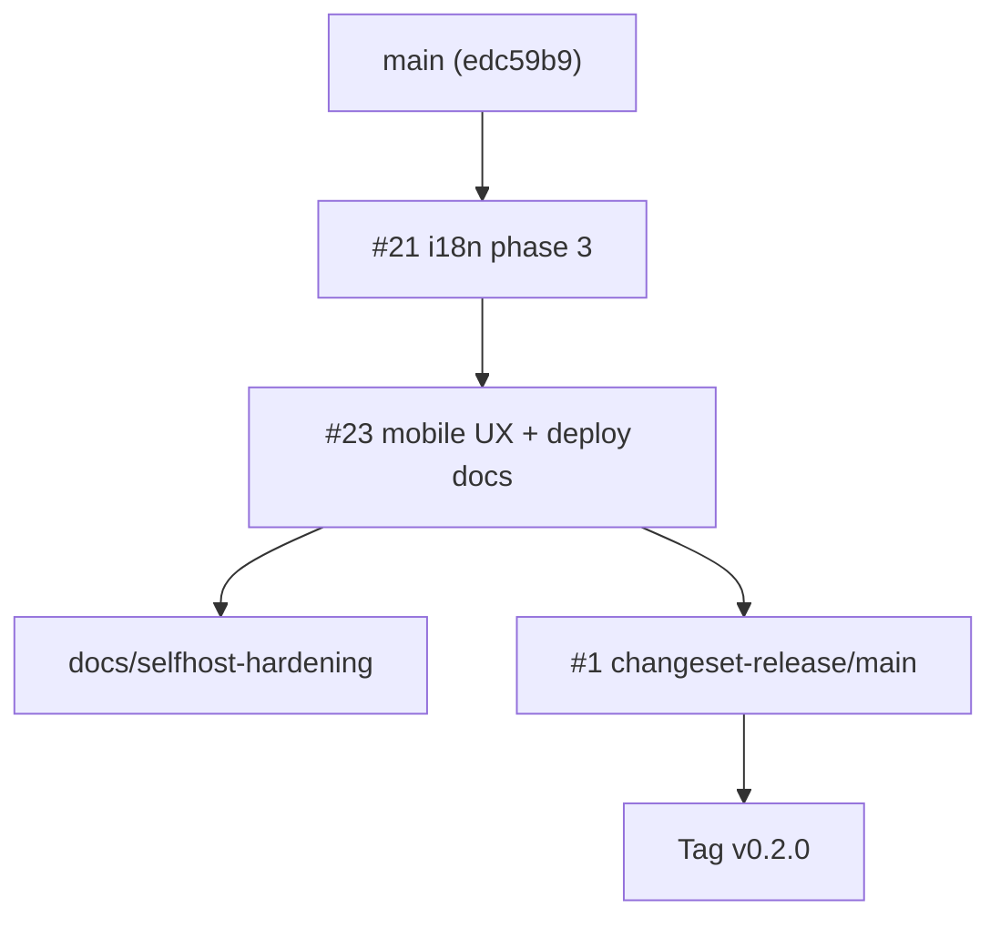

# July 11 release checklist

> **Target:** public v0.2.0 ship readiness — self-host validation, demo, and release
> mechanics. **Do not merge PRs from this doc alone**; use it as the operator
> runbook.
>
> **Last validated:** 2026-07-09 — Path C plan **COMPLETE**. Config OK on `main`.
> Web image build fixed on `fix/selfhost-web-docker` (shared-types `dist/` +
> `NEXT_PUBLIC_API_URL` build arg + empty `public/`). API + regression green
> locally (492 + 40 tests; #33 serializes `@requires-db` file runs).
>
> **Related docs:**
> [`SELF_HOSTING.md`](./SELF_HOSTING.md) · [`DEPLOYMENT.md`](./DEPLOYMENT.md) ·
> [`BUSINESS_MODEL.md`](./BUSINESS_MODEL.md) · [`LOCAL_CI.md`](./LOCAL_CI.md) ·
> [`deploy/`](../../../deploy/README.md)

---

## 1. Pre-flight status (2026-07-09 COMPLETE)

| Item | Status | Notes |
| ---- | ------ | ----- |
| `deploy/docker-compose.selfhost.yml` syntax | ✅ Pass | Re-validated 2026-07-09 with `deploy/.env.example` |
| Compose without `--env-file` | ⚠️ Expected fail | `BETTER_AUTH_SECRET` is required (`:?` guard) — always pass `--env-file deploy/.env` |
| `deploy/` on `main` | ✅ Merged | Via PR #23 (`feature/mobile-ux`) |
| Self-host / deployment docs on `main` | ✅ Merged | `SELF_HOSTING.md`, `DEPLOYMENT.md`, `BUSINESS_MODEL.md` via #23 + #24 |
| `JULY11_CRITICAL_PATH.md` | ✅ On `main` | Updated Jul 9 — plan COMPLETE |
| Path C merge train | ✅ Complete | #12, #20, #22, #24–#33; GH Actions off until 2026-08-01 |
| Release PR [#1](https://github.com/tzjing99/SmartResidence/pull/1) | ✅ Merged | `@smartresidence/*@0.2.0` — tag [`v0.2.0`](https://github.com/tzjing99/SmartResidence/releases/tag/v0.2.0) |
| Local API + regression | ✅ Pass | `ci:test:api` 492 tests; `ci:test:regression` 40 tests serial (2026-07-09, #33) |
| Full stack smoke (`up --build`) | 🔧 Fixed (PR) | `docker compose ... build web` succeeds after shared-types prebuild; full `up` still needs secrets + infra |
| GHCR images | ⏭ Blocked | Hosted Actions minutes exhausted until 2026-08-01 |

---

## 2. Merge order (remaining → `main`)

Merge **bottom-up** in stacked chains; rebase downstream PRs after each merge.

### 2.1 Critical path (ship blockers)

These must land before tagging v0.2.0 and publishing self-host docs.

| Order | PR | Branch → base | Why critical | Blocker |
| ----- | -- | ------------- | ------------ | ------- |
| 1 | [#21](https://github.com/tzjing99/SmartResidence/pull/21) | `feature/i18n-phase3-guard-auth` → `main` | i18n phase 3 (guard/auth/live); base for mobile UX | **Lint (Biome) failing** — fix before merge |
| 2 | [#23](https://github.com/tzjing99/SmartResidence/pull/23) | `feature/mobile-ux` → `feature/i18n-phase3-guard-auth` | Mobile UX backlog + **`deploy/`**, **`docs/SELF_HOSTING.md`**, **`docs/DEPLOYMENT.md`**, **`docs/BUSINESS_MODEL.md`** | Rebase after #21; CI not yet run on latest push |

After #21 + #23 are on `main`, optionally merge a **docs-only follow-up** from
`docs/selfhost-hardening` (this checklist) if not cherry-picked into #23.

### 2.2 Recommended before demo (not hard blockers)

| PR | Title | Rationale |
| -- | ----- | --------- |
| [#22](https://github.com/tzjing99/SmartResidence/pull/22) | Mobile a11y lite | Demo quality on device |
| [#11](https://github.com/tzjing99/SmartResidence/pull/11) | WCAG AA lite (web) | Public-facing web polish |
| [#20](https://github.com/tzjing99/SmartResidence/pull/20) | PDPA user export | Compliance story for MY market |
| [#16](https://github.com/tzjing99/SmartResidence/pull/16) | Fiuu e-wallet policy docs | Aligns payment messaging |

### 2.3 Safe to defer past July 11

Governance (AGM/proxy/minutes), TNG adapter, platform console F2, observability
metrics, integration-test hardening, session/device UI, billing exports, i18n
phase 2 page content, announcements AVIF pipeline (draft PR #3).

### 2.4 Merge sequence diagram



---

## 3. Docker self-host smoke test

> **Prerequisite:** PR #23 merged (or checkout `feature/mobile-ux` locally).
> Config validation alone does **not** require a build.

### 3.1 Config-only validation (quick — ~5 s)

```bash
cp deploy/.env.example deploy/.env
# Edit deploy/.env — set BETTER_AUTH_SECRET and BILLING_ENCRYPTION_KEY to
# unique 32+ char values (openssl rand -base64 48)

docker compose -f deploy/docker-compose.selfhost.yml --env-file deploy/.env config
# Expect exit 0 and resolved service list
```

### 3.2 Full stack smoke (allow 15–30 min first build)

```bash
docker compose -f deploy/docker-compose.selfhost.yml --env-file deploy/.env up -d --build

# Wait for migrate (one-shot) then api healthy
docker compose -f deploy/docker-compose.selfhost.yml ps
curl -sf http://localhost:4000/health | jq .
# Expect: { "status": "ok", "checks": { "database": "ok", "redis": "ok" } }

curl -sf -o /dev/null -w "%{http_code}\n" http://localhost:3000
# Expect: 200 or 307 (login redirect)

open http://localhost:8025   # Mailpit — no real mail sent
```

### 3.3 First login paths

| Path | Steps | Pass criteria |
| ---- | ----- | ------------- |
| **Clean install** | Open http://localhost:3000/admin/setup | Setup wizard completes; dashboard banner clears |
| **Demo data** | From repo checkout: `corepack pnpm db:seed` with `DATABASE_URL` pointing at container Postgres | Seed prints demo accounts; login works |
| **Resident flow** | Log in as `owner@acacia.demo` | Home, billing, visitors load |
| **Guard flow** | Log in as `guard@acacia.demo` at `/guard` | Scan/expected visitors screens load |
| **Admin flow** | Log in as `admin@acacia.demo` at `/admin` | Dashboard + billing surfaces load |

### 3.4 Teardown

```bash
docker compose -f deploy/docker-compose.selfhost.yml --env-file deploy/.env down
# Add -v to wipe postgres_data / redis_data / minio_data volumes
```

### 3.5 Known gaps (document, don't block v0.2.0)

- `NEXT_PUBLIC_API_URL` is baked at **web image build time** — non-localhost
  domains need rebuild or single-origin reverse proxy (see `docs/DEPLOYMENT.md`).
- No in-image seed — use dev seed or setup wizard.
- `deploy/` is **draft**, not wired into CI release workflow yet.
- MinIO `:9000/:9001` and Mailpit `:8025` are published for trials; lock down
  in production.

---

## 4. Demo credentials

Password for **all** demo users: `Demo!2026`

| Role | Email | Login surface |
| ---- | ----- | ------------- |
| Resident (owner) | `owner@acacia.demo` | Web `/` · mobile resident mode |
| Resident (tenant) | `tenant@acacia.demo` | Web `/` · mobile |
| Management admin | `admin@acacia.demo` | Web `/admin` |
| Security guard | `guard@acacia.demo` | Web `/guard` · mobile guard mode |

**Demo condo:** Acacia Heights (seeded by `corepack pnpm db:seed` in dev bring-up).

> ⚠️ Never use demo passwords or default infra secrets (`smartresidence`) in
> production. Rotate `POSTGRES_PASSWORD`, `S3_*`, and auth secrets in
> `deploy/.env`.

---

## 5. Changeset & release process (PR #1)

### 5.1 Per-feature PRs

Each user-facing PR should include a changeset:

```bash
pnpm changeset
# Pick affected packages, bump type (patch/minor), one-line summary
git add .changeset/*.md && git commit -m "chore: add changeset for <feature>"
```

CI refuses merges without a changeset (docs-only/chore exempt).

### 5.2 Release PR workflow

1. Merge feature PRs to `main` (with changesets).
2. GitHub Action `release.yml` opens/updates **PR #1**
   (`changeset-release/main` → `main`).
3. Review PR #1: version bumps, `CHANGELOG.md` entries across packages.
4. **Merge PR #1** → Changesets publishes to npm (requires `NPM_TOKEN`).
5. Tag **`v0.2.0`** on the resulting `main` commit (or let Changesets + follow-up
   tag step per your release policy).
6. Push tag → `release.yml` builds and pushes Docker images to GHCR:
   - `ghcr.io/tzjing99/smartresidence-api`
   - `ghcr.io/tzjing99/smartresidence-web`
7. Create GitHub Release notes (auto-generated via `softprops/action-gh-release`).

### 5.3 July 11 release checklist (operator)

- [x] All critical-path PRs merged (#21 absorbed via #23; #23 merged)
- [x] Fresh changeset summarizing v0.2.0 scope merged to `main` (#29)
- [x] PR #1 updated and merged
- [x] `v0.2.0` tag pushed; GitHub Release published
- [ ] GHCR images published — blocked until Actions minutes reset **2026-08-01**
- [x] Self-host config smoke (§3.1) passed; `build web` succeeds after Dockerfile fix (shared-types + public/)
- [ ] Demo seeded or setup wizard verified (operator day-of)
- [ ] Homepage copy reviewed (§6) — **do not edit live site until approved**

---

## 6. Homepage messaging (from BUSINESS_MODEL.md §9)

Draft copy only — finalize before publishing. Voice: confident, plain-English,
Malaysia-first.

### Hero

- **Eyebrow:** Open-source condo & strata management — built for Malaysia
- **Headline:** Run your building, not a spreadsheet.
- **Subhead:** SmartResidence is a modern, transparent management platform for
  condos and strata communities — billing, visitors, defects, facilities, and
  governance in beautiful apps residents and guards actually like using.
  **Free to self-host. Managed hosting when you'd rather we ran it.**
- **Primary CTA:** Start free — self-host in minutes
- **Secondary CTA:** See managed pricing
- **Trust line:** MyInvois-ready · PDPA-aware · DuitNow QR & e-wallets · AGPL open source

### Key sections to ship

| Section | Heading | Core message |
| ------- | ------- | ------------ |
| Two paths | Free to explore, paid when you're ready | Self-host free forever (AGPL, full app) vs managed cloud (backups, support) |
| Compliance | Compliance that isn't a scramble | SMA 2013 fund separation, COB exports, MyInvois e-invoice |
| Transparency | Radical transparency, by default | Audited actions; owners see who viewed their unit data |
| Mobile | Apps people actually like | Residents: DuitNow QR, visitors, defects; Guards: QR scan, offline gate |
| Pricing teaser | Simple pricing, per building | Self-host free; managed from ~RM149/mo (illustrative) |
| Final CTA | Your community deserves better than eCommunity | Start free · Talk to us about managed hosting |

Full copy blocks: see [`docs/BUSINESS_MODEL.md`](./BUSINESS_MODEL.md) §9 (available after PR #23 merge).

---

## 7. Developer bring-up (fallback if Docker full-stack blocked)

Canonical, fully-supported path today — use for demo if self-host build fails:

```bash
corepack pnpm install
cp apps/api/.env.example apps/api/.env
cp apps/web/.env.example apps/web/.env.local
corepack pnpm infra:up
corepack pnpm db:migrate
corepack pnpm db:seed
corepack pnpm dev
```

| URL | Purpose |
| --- | ------- |
| http://localhost:3000 | Web |
| http://localhost:4000/health | API health |
| http://localhost:8025 | Mailpit |

---

## 8. Day-of timeline (suggested)

| When | Action |
| ---- | ------ |
| **Jul 4–5** | Fix #21 lint; merge #21 → rebase/merge #23 |
| **Jul 5–6** | Full self-host smoke (§3); dev bring-up fallback verified |
| **Jul 7** | Merge release changeset; merge PR #1 |
| **Jul 8** | Tag `v0.2.0`; verify GHCR images |
| **Jul 9–10** | Homepage copy review; demo rehearsal with Acacia Heights |
| **Jul 11** | Publish release notes + announce self-host guide |

---

## 9. Open questions

1. **Version number:** PR #1 currently bumps to `@smartresidence/*@0.2.0` from
   stale changeset — confirm scope warrants minor vs patch.
2. **Homepage:** Who approves §6 copy and deploys the marketing site?
3. **Demo hosting:** Public demo VM or self-host guide only for July 11?
4. **PR #23 base:** Consider retargeting to `main` after #21 merges to simplify
   the stack.
