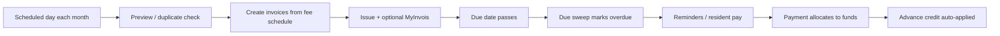

# Billing cycle automation

This guide explains how SmartResidence generates **monthly maintenance invoices** automatically — for JMB treasurers and system admins. Plain English first; code references for implementers.

## Where to manage it

**Primary path (recommended):** **Admin → Invoices** → **Automatic invoice generation** panel at the top of the page.

**Not buried in settings:** Fee *rates* live under **Settings → Billing**, but the *schedule* (which day to run, due date rules) is on the Invoices tab so finance staff find it next to the invoice list.

**Setup wizard:** During initial setup, the billing step links directly to `/admin/invoices#automation`.

## Monthly cycle overview

| Stage | Service | What happens |
|-------|---------|--------------|
| Schedule | `BillingAutomationScheduleService` + cron | Finds condos with automation enabled whose generation day has arrived |
| Preview | `BillingAutomationService.previewCondo` | Counts billable units, detects already-billed periods |
| Run | `BillingAutomationService.runCondo` | Calls `BillingService.generateRecurring` (duplicate-safe) |
| Track | `AutomationStatusService` | Writes `AutomationRun` rows (PENDING → RUNNING → SUCCESS/FAILED/SKIPPED) |
| Due sweep | `BillingService.runDueSweep` | Separate job: marks overdue, does **not** create invoices |
| Advance pay | `LedgerService` + billing payment flow | Credit balance applied to oldest open invoices first |

## Automation settings (condo `settings.billingAutomation`)

| Field | Meaning | Typical JMB value |
|-------|---------|-------------------|
| `enabled` | Master switch | On after fee rates configured |
| `generationDay` | Calendar day to run (1–31, clamped to month end) | `1` (1st of month) |
| `periodStrategy` | `NEXT_MONTH` or `CURRENT_MONTH` | `NEXT_MONTH` — bill July on 1 July |
| `dueStrategy` | `DAY_OF_MONTH` or `OFFSET_DAYS` | `DAY_OF_MONTH` |
| `dueDay` | Due on Nth day of billing period month | `15` |
| `dueOffsetDays` | If offset strategy: days after period start | `14` |

Preview shows plain timeline:

- **Next run:** scheduled date (or “today” if due)
- **Creates invoices for:** N units
- **Billing period:** start — end
- **Due date:** from settings

## Fee formulas

### Unit type base rates

For each unit type (**Settings → Billing → Base maintenance and sinking fund**):

- **Maintenance** — `PER_SQFT` (rate × unit sqft) or `FLAT`
- **Sinking fund** — same rate types, separate amount

These become invoice lines `MAINT` and `SINKING`, which post to separate ledger funds.

### Extra lines (`FeeScheduleExtraLine`)

Common presets: fire insurance, quit rent, assessment, facility charges, special levies.

Rate types:

- `FLAT` — same for every unit
- `PER_SQFT` — uses unit floor area
- `PER_UNIT_TYPE` — different amount per layout

Extra lines are merged into recurring generation when `recurring: true` and effective for the billing month.

Implementation: `FeeScheduleService.computeExtraLinesForUnit`.

## Duplicate safety

Before creating invoices, automation checks for an existing **non-void** invoice for the same unit + period. If all billable units already have one, run status is `already_generated` and **nothing** is created twice.

Manual **Generate monthly invoices** on the Invoices page uses the same duplicate logic.

## Due sweep vs invoice generation

| Action | Button / job | Creates invoices? |
|--------|--------------|-------------------|
| Automatic generation | Invoices → automation / cron | **Yes** |
| Check overdue invoices | Invoices → “Check overdue invoices” | **No** — only status/reminders |

Do not confuse the two when training staff.

## Advance payment auto-apply

When a unit has **advance credit** (prepayment recorded under Accounting):

1. New charges increase the unit balance.
2. On payment allocation or internal apply logic, credit reduces outstanding oldest-first.
3. Receipts issued for prepayments; ledger type `PREPAYMENT` / `PREPAYMENT_APPLIED`.

Treasurers record advance maintenance payments under **Accounting → Record advance maintenance payment**.

## AutomationRun records

Each non-dry run creates an automation run visible under **Admin → Automations** (status board):

- Job key: `BILLING_GENERATION`
- Summary: units created / skipped / no rate
- Audit log entry for accountability

Dry run (“Preview without creating”) returns counts only — no invoices, no run record.

## API reference

| Endpoint | Purpose |
|----------|---------|
| `GET /api/billing/automation/condo/:condoId` | Read settings |
| `PATCH /api/billing/automation/condo/:condoId` | Update settings |
| `GET /api/billing/automation/condo/:condoId/preview` | Preview counts |
| `POST /api/billing/automation/condo/:condoId/run` | Manual run (`dryRun: true` optional) |

## Tests

`billing-automation.service.spec.ts` covers:

- Window calculation (next-month period, due day clamping)
- Dry run (no `generateRecurring` call)
- Scheduled run through duplicate-safe generation
- Skip when all units already billed for the period

## Treasurer checklist (monthly)

1. Confirm fee rates and extra lines for the month.
2. Open Invoices → automation → verify preview counts.
3. Let scheduled run execute (or **Generate invoices now** after preview).
4. Review new invoices; submit MyInvois if required.
5. After due date, run **Check overdue invoices**.
6. Export Accounting fund summary for records.
